# ENTERPRISE SOLUTION DESIGN DOCUMENT
# Production HR Agentic Solution — Architecture Specification
### Powered by Gemini Enterprise Agent Platform (GEAP), Gemini Enterprise App, Gemini Multimodal Live API, Vertex AI Integration Connectors, Vertex AI Search Grounding, Google Cloud Operations SRE Suite, Google ADK 2.0, Gemini 3.7 Flash, Gemini 3.1 Pro & MCP

---

## 📋 Executive Overview & Quick Reference

> [!IMPORTANT]
> **Production Architecture Directives & Guarantees**:
> * **Dual Enterprise UI Surfaces**:
>   1. **Primary Workspace UI (Gemini Enterprise App & Google Chat)**: Turnkey enterprise access published to **`gemini.google.com`**, **Google Chat (DMs & Spaces)**, and **Google Workspace side panels** via the **GEAP Agent Registry (`agents-cli publish gemini-enterprise`)** with native Cloud Identity SSO.
>   2. **Secondary Web Portal UI (Dual-Mode Embeddable Web Assistant)**: Self-contained Web Component (`<hr-assistant-widget />`) embedded into the corporate Intranet / HR Portal, supporting **Streaming Text Chat (SSE)** and an instant **Live Voice Streaming Toggle (`[ 🎙️ Go Live ]`)** powered by the **Gemini Multimodal Live API (WebSockets)** with real-time barge-in and synchronized visual cards.
> * **Automated Security & Active PII Perimeter (Google Cloud Model Armor)**: Automated, inline PII de-identification and threat screening inspecting all inbound prompts, audio transcripts, and tool return payloads before foundation model ingestion, replacing sensitive tokens (`[REDACTED_SSN]`, `[REDACTED_PHONE]`, `[REDACTED_HEALTH_INFO]`) with zero model weight memorization.
> * **Enterprise AI Gateway & Multi-Tier Rate Limiting**: Managed **GEAP Agent Gateway** enforcing token-bucket rate limits ($50\text{ req/min/user}$, $500\text{ req/min/IP}$, $2,000\text{ concurrent streams}$) and downstream ERP/ITSM concurrency bounds ($100\text{ req/s}$ WorkWeek, $50\text{ req/s}$ ServiceImmediately) with rate-limit headers (`X-RateLimit-*`) and standard $429$ backoff handling.
> * **Production-Grade Hierarchical Multi-Agent Mesh**: Standardizes on an enterprise-grade multi-agent topology featuring a **Root Orchestrator (Gemini 3.1 Pro)** coordinating specialized **Sub-Agents (Gemini 3.7 Flash)**. Delivers physical blast radius isolation, domain-level least privilege (strict read-only vs. mutating IAM boundaries), and seamless horizontal scalability across enterprise business units.
> * **Native Vertex AI Search Grounding Verification**: Google-managed private data store grounding delivering sentence-by-sentence attribution mapping (`groundingSupports`), exact PDF page citations, and automated refusal gates when the mathematical `groundingScore` falls below $\mathbf{0.85}$.
> * **Streamlined Enterprise Ingress & Runtime**: Fully managed on Google Cloud (**GEAP Agent Gateway**, **Managed Agent Runtime**, **Vertex AI Agent Engine**, and **Vertex AI Integration Connectors** with synchronous retries) with zero container maintenance or unmanaged VM overhead.
> * **Sequential Multi-Step ADK Workflows**: Streamlines complex cross-system actions into **Linear Multi-Step Workflows** powered by **Vertex AI Agent Engine Session State** and mandatory **Human-in-the-Loop (HITL) Action Confirmation Cards**.
> * **Standard Model Context Protocol (MCP) Integration**: Connects natively to **WorkWeek** and **ServiceImmediately** standard MCP endpoints (`/work-week/mcp/`, `/service-immediately/mcp/`) via **Vertex AI Integration Connectors (Managed MCP Connector)** with built-in connection pooling, VPC security, and Secret Manager authentication.
> * **Enterprise Two-Tier Observability & SRE Alerting**: Seamlessly unites **Tier 1 (GEAP AI-Semantic Observability)** for trajectory debugging, drift tracking, and Looker Studio HR analytics with **Tier 2 (Google Cloud Operations SRE Suite)** for 24/7 PagerDuty alerting, 99.9% SLO error budget tracking, Cloud Error Reporting, and 365-day immutable compliance log buckets (`google_logging_project_bucket_config`).
> * **Production FinOps**: Fully serverless enterprise deployment with projected baseline operating costs of **~\$68.50/month** (~50,000 interactions/month).

| Dimension | Architectural Specification | Key Benefit |
| :--- | :--- | :--- |
| **Conversational UI Surfaces** | **Dual Frontend**: (1) **Gemini Enterprise App + Google Chat** (Primary Workspace) & (2) **Embeddable Dual-Mode Web Widget** (Intranet Portal) | Omnichannel reach across Google Workspace and intranet web portals with instant live voice streaming toggle. |
| **Automated PII Defense** | **Google Cloud Model Armor (Inline Inspection & DLP Templates)** | Automated in-stream redaction of SSN, phone, address, health info before LLM reasoning layers. |
| **Ingress & Throttling** | **GEAP Agent Gateway (Token Bucket Rate Limiter)** | $50\text{ req/min/user}$, $500\text{ req/min/IP}$, $2,000$ concurrent streams, and downstream protection. |
| **Agentic Architecture** | **Root Orchestrator (Gemini 3.1 Pro)** + **3 Sub-Agents (Gemini 3.7 Flash)** | Production blast radius isolation, independent domain lifecycles, and cross-department scalability. |
| **Knowledge & Grounding** | **Dynamic Hybrid RAG + Vertex AI Search Grounding Verification** | Exact sentence attributions, page deep-links, `groundingScore >= 0.85`, and zero hallucination. |
| **Enterprise Integration Fabric** | **Vertex AI Integration Connectors (MCP + Pre-Built)** | Managed connection pooling, VPC security, synchronous retries, and standard MCP discovery. |
| **Agent Execution Runtime** | **GEAP Managed Agent Runtime (Vertex AI Agent Engine)** | Zero-container serverless execution, native session binding, and built-in Agent Analytics. |
| **Two-Tier Observability** | **GEAP Native Suite + Google Cloud Operations SRE Suite** | Visual Trajectory Debugging & BigQuery Analytics paired with PagerDuty alerts, SLO tracking, and Cloud Error Reporting. |
| **Evaluation Framework** | **Vertex AI Gen AI Evaluation Service (Offline & Online)** | 500+ Golden Dataset CI/CD gate, $5\%$ continuous production sampling, and automated human review queue. |
| **Identity & Access** | **Google Cloud Identity (OAuth2 / OIDC Bearer Tokens + OBO Exchange)** | Zero-trust authentication with automated gateway context injection and On-Behalf-Of delegation. |
| **State & Workflow Execution** | **Sequential ADK Workflows + Vertex Session Engine** | Turn-level state tracking, client UUIDv4 idempotency deduplication, and zero transaction boilerplate. |
| **Infrastructure as Code** | **HashiCorp Terraform** modular structure with Remote GCS State & GitOps | 100% declarative provisioning with environment-tiered log retention (30d dev / 365d prod lock). |

---

## 📑 Table of Contents
1. [Executive Summary & High-Level System Architecture](#1-executive-summary--high-level-system-architecture)
2. [Production-Ready Topology & Scale Strategy](#2-production-ready-topology--scale-strategy)
3. [Multi-Agent Mesh, System Flows & Sequence Design](#3-multi-agent-mesh-system-flows--sequence-design)
4. [Security Perimeter, Identity & AI Firewall Deep-Dive](#4-security-perimeter-identity--ai-firewall-deep-dive)
5. [Integration Connectors, Knowledge Ingestion & Grounding Deep-Dive](#5-integration-connectors-knowledge-ingestion--grounding-deep-dive)
6. [Sizing, Cost Estimation & FinOps](#6-sizing-cost-estimation--finops-baseline-topology)
7. [Infrastructure as Code (IaC), GitOps & Implementation Roadmap](#7-infrastructure-as-code-iac-gitops--implementation-roadmap)
8. [Comprehensive Risk & Mitigation Matrix](#8-comprehensive-risk--mitigation-matrix)
9. [Two-Tier Observability, Quality Flywheel & Fleet Governance](#9-two-tier-observability-quality-flywheel--fleet-governance)
10. [Assumptions & Open Decisions](#10-assumptions--open-questions)

---

## 1. Executive Summary & High-Level System Architecture

### 1.1. Business Challenges & Solution Vision

Modern enterprises face significant operational friction in employee service delivery. Support organizations spend thousands of human hours each month answering routine Tier 1 policy inquiries, processing standard paid time off (PTO) requests, and manually logging IT equipment tickets. Employees must constantly context-switch across fragmented legacy portals:
* **WorkWeek**: The core Human Capital Management (HCM) platform holding employee profile records, leave balances, organizational hierarchies, and time-off booking workflows.
* **ServiceImmediately**: The enterprise IT Service Management (ITSM) and HR Service Delivery (HRSD) engine managing hardware procurement, access provisioning, and support tickets.
* **Static Intranet Document Repositories**: PDF handbooks, Google Drive folders, and CMS portals containing hundreds of pages of evolving corporate leave guidelines, relocation allowances, and travel policies.

This fragmentation leads to prolonged average handle times (AHT), frequent administrative errors, and employee dissatisfaction. 

#### The Solution Vision
The **Production HR Agentic Solution** establishes a centralized, intelligent virtual employee assistant built natively on the **Gemini Enterprise Agent Platform (GEAP)**. By unifying natural language understanding, dynamic policy retrieval, and enterprise tool execution into a governed multi-agent mesh, the solution empowers employees to resolve complex, cross-system tasks in seconds while providing enterprise-grade security, full legal auditability, and zero hallucination risk.

---

### 1.2. High-Level Macro Architecture (The Big Picture)

The high-level macro architecture supports **Dual Enterprise UI Frontends** communicating with a unified Google Cloud security and agent execution core:

> 💼 **Executive Architecture Summary**: Depicts the end-to-end enterprise processing pipeline across 4 decoupled stages: Dual Client Surfaces (Gemini App + Web Widget) authenticate via Cloud Identity at the GEAP Agent Gateway, undergo Model Armor AI threat screening, execute through the serverless Multi-Agent Core, and interact securely with WorkWeek, ServiceImmediately, and Vertex AI Search Grounding.

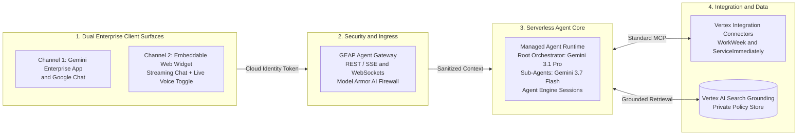

#### Detailed Narrative of the 4-Stage Macro Pipeline:

1. **Stage 1: Dual Enterprise Conversational Client Surfaces**:
   * **Channel 1 (Primary Workspace Surface)**: Published directly into the **Gemini Enterprise App (`gemini.google.com`)**, **Google Chat (DMs & Spaces)**, and the **Google Workspace side panel** (within Gmail, Docs, and Calendar) via the **GEAP Agent Registry** (`agents-cli publish gemini-enterprise`). Provides a zero-maintenance conversational interface with native Google Workspace SSO.
   * **Channel 2 (Secondary Web Portal Surface)**: A lightweight, self-contained Web Component (`<hr-assistant-widget />`) embedded into the corporate Intranet or HR Portal. Operates in two seamless modes:
     * *Text Chat Mode (Default)*: High-speed streaming text over Server-Sent Events (SSE) with clickable suggestion chips and interactive HITL Action Cards.
     * *Live Voice Mode (`[ 🎙️ Go Live ]`)*: Full-duplex, low-latency conversational audio streaming powered by the **Gemini Multimodal Live API (WebSockets)**, featuring natural speech pacing, real-time barge-in interruption, and synchronized on-screen visual cards.
2. **Stage 2: Enterprise AI Ingress, Gateway Rate Limiting & Active Security Perimeter**:
   * Inbound HTTPS (REST/SSE) and WebSocket connections terminate at the **GEAP Agent Gateway**. The gateway validates corporate **Google Cloud Identity OAuth2 Bearer tokens**, extracts verified employee identity claims (e.g. `EMP1024`), and enforces a token-bucket rate limiter ($50\text{ req/min/user}$).
   * In-flight prompts and audio transcripts pass through **Google Cloud Model Armor**, an active AI firewall that screens for direct prompt injections, jailbreak attempts, and toxic content. Model Armor automatically masks sensitive Personally Identifiable Information (SPII) such as Social Security Numbers (`[REDACTED_SSN]`) before prompts reach model reasoning layers.
3. **Stage 3: Serverless Multi-Agent Execution Runtime**:
   * The core agentic logic runs entirely within the **GEAP Managed Agent Runtime**, hosted in Google Cloud region `us-central1`. The runtime provides a serverless execution environment with native auto-scaling, scale-to-zero efficiency, and built-in session state binding via **Vertex AI Agent Engine**.
   * Architecture uses a **Hierarchical Multi-Agent Mesh**:
     * **Root Orchestrator (`Gemini 3.1 Pro`)**: High-reasoning model responsible for intent classification, sub-agent dispatching, sequential workflow state coordination, and human confirmation gating.
     * **Specialized Domain Sub-Agents (`Gemini 3.7 Flash`)**: Ultra-fast, cost-effective models isolated to specific business domains (`PolicyQAAgent`, `WorkWeekAgent`, `ServiceImmediatelyAgent`).
4. **Stage 4: Enterprise Integration Fabric & Grounded Knowledge Plane**:
   * To execute transactional mutations or fetch personal employee records, sub-agents communicate through **Vertex AI Integration Connectors**. The connector fabric provides a **Managed MCP Connector** that communicates over Streamable HTTP with standard Model Context Protocol (MCP) endpoints (`/work-week/mcp/`, `/service-immediately/mcp/`), incorporating automatic 3x synchronous retries with jitter and Secret Manager credential management.
   * For policy questions, the `PolicyQAAgent` queries **Vertex AI Search Grounding**, which performs dense vector retrieval over private corporate PDFs stored in Cloud Storage (`gs://${PROJECT_ID}-hr-policies/`). It computes sentence-level attribution (`groundingSupports`) and mathematically evaluates factual confidence, executing an automated refusal gate when `groundingScore < 0.85`.

---

### 1.3. Production Scope Boundaries

#### ✅ In-Scope for Production Deployment
* **Dual Conversational Delivery Channels**: 
  * *Primary*: **Gemini Enterprise App (`gemini.google.com`)**, **Google Chat (DMs & Spaces)**, and **Google Workspace side panels** via **GEAP Agent Registry (`agents-cli publish gemini-enterprise`)**.
  * *Secondary*: **Embeddable Dual-Mode Web Assistant (`<hr-assistant-widget />`)** on Intranet/HR portals with text streaming and Gemini Multimodal Live voice toggle.
* **Automated PII Redaction & Active Defense**: Google Cloud Model Armor inspecting prompt ingress, tool payloads, and model egress, masking SSN, phone, address, credit cards, and sensitive medical leave reasons.
* **Multi-Tier Rate Limiting**: Agent Gateway token bucket throttling ($50\text{ req/min/user}$, $500\text{ req/min/IP}$) and downstream MCP concurrency limits ($100\text{ req/s}$ WorkWeek, $50\text{ req/s}$ ServiceImmediately).
* **Multi-Agent Domain Architecture**: Production-grade hierarchical decomposition with **Gemini 3.1 Pro** as Root Orchestrator and **Gemini 3.7 Flash** for specialized Sub-Agents (Policy Q&A, WorkWeek HCM, ServiceImmediately ITSM).
* **Vertex AI Search Grounding Verification**: Private data store grounding with `text-embedding-005`, BM25 hybrid search, layout-aware chunking, sentence attribution (`groundingSupports`), and confidence gating (`groundingScore >= 0.85`).
* **Vertex AI Integration Connectors**: Managed connectivity fabric featuring the **Managed MCP Connector** for standard MCP endpoints (WorkWeek & ServiceImmediately) with built-in synchronous retry logic and connectivity readiness for supported enterprise SaaS (Jira, SAP, Salesforce, Workday, ServiceNow).
* **GEAP Agent Gateway**: Unified AI ingress managing Cloud Identity OAuth2 token validation, per-user rate limiting, streaming SSE responses, WebSocket live sessions, and inline Model Armor attachment.
* **GEAP Managed Agent Runtime**: Purpose-built serverless runtime executing ADK 2.0 multi-agent meshes with native session and memory wiring.
* **Two-Tier Observability Architecture**:
  * *Tier 1 (GEAP AI Observability)*: Trajectory Debugger, Semantic Drift Detection, Feedback Telemetry, BigQuery Streaming Export, and Cloud Trace latency waterfalls.
  * *Tier 2 (Cloud Operations SRE Suite)*: Cloud Monitoring SRE Alert Policies (PagerDuty/Slack), 99.9% SLO tracking, Cloud Error Reporting, and Environment-Tiered Log Buckets (30d dev / 365d prod lock) with SIEM export.
* **Offline & Online Evaluation Framework**: 500+ golden dataset CI/CD quality gate, continuous $5\%$ live traffic sampling, and human escalation queue.
* **WorkWeek MCP Integration**: Balances lookup, personal info updates, PTO submissions, and leave cancellations.
* **ServiceImmediately MCP Integration**: Incident search, ticket creation, status updates, and timeline comments.
* **Sequential Multi-Step Workflows**:
  * `UC-2.1`: Equipment Procurement (Policy check $\rightarrow$ Profile validation $\rightarrow$ HITL Confirmation $\rightarrow$ Hardware ticket).
  * `UC-2.2`: Medical Leave (Policy guidance $\rightarrow$ Multi-Action HITL $\rightarrow$ WorkWeek LOA $\rightarrow$ Email routing ticket).
  * `UC-2.3`: Relocation (Allowance lookup $\rightarrow$ HITL Confirmation $\rightarrow$ Address update $\rightarrow$ Badge access ticket).
* **Enterprise IaC & Delivery**: 100% codified via HashiCorp Terraform modules with remote GCS state management.

#### ❌ Out-of-Scope for Current Release
* Direct payroll/compensation modifications or unconfirmed autonomous ERP writes.
* Legacy PSTN/PBX hardware telephony trunk integration (WebRTC/WebSocket voice on browser/mobile is in-scope).
* Multi-tenant physical infrastructure isolation (single-tenant enterprise project deployment).

---

### 1.4. Architectural Alternatives Considered & Decision Rationalization

| Decision Area | Selected Production Approach | Alternative Considered | Production Trade-Off Analysis & Rationalization |
| :--- | :--- | :--- | :--- |
| **Secondary Web Portal UI** | **Custom Embeddable Dual-Mode Web Widget (`<hr-assistant-widget />`) with Gemini Multimodal Live Voice Toggle** | Turnkey Gemini Enterprise for Customer Experience (GECX) Web Messenger | **Production Rationale**: GECX Web Messenger only supports turn-based speech-to-text dictation (half-duplex) and does not natively support true full-duplex, low-latency, interruptible voice streaming with barge-in. A custom lightweight Web Component (~300 lines of TS) using the Gemini Multimodal Live API delivers sub-second bidirectional voice streaming with synchronized on-screen action cards while maintaining 100% branding and CSS control. |
| **Primary Workspace UI** | **Gemini Enterprise App (`gemini.google.com`) & Google Chat (via GEAP Agent Registry)** | Custom Standalone React / Next.js Web App on Cloud Run | **Production Rationale**: Publishing to Gemini Enterprise App via GEAP Agent Registry (`agents-cli publish gemini-enterprise`) provides a turnkey, fully managed conversational UI with native Cloud Identity SSO, mobile device support, Google Chat bot access, and interactive HITL action cards with zero frontend maintenance. |
| **Agentic Topology** | **Hierarchical Multi-Node Agent Mesh (Gemini 3.1 Pro Root + Gemini 3.7 Flash Sub-Agents)** | Single Monolithic ADK Agent with Shared Toolsets | **Production Rationale**: In enterprise production, domain security, blast radius isolation, and independent team ownership are paramount. Multi-agent decomposition guarantees that `PolicyQAAgent` is strictly read-only at the IAM layer, preventing policy queries from ever mutating ERP records, while allowing the system to scale horizontally to 10+ enterprise departments without prompt bloat. |
| **Grounding & Verification** | **Vertex AI Search Grounding Verification (`groundingScore >= 0.85`)** | Custom Multi-Step NLI Claim Decomposition Pipeline | **Production Rationale**: Vertex AI Search Grounding performs single-pass generation, sentence-level attribution mapping (`groundingSupports`), and mathematical confidence scoring directly within Google Cloud's inference layer. It eliminates the 500ms–1.0s latency penalty and 3x token compute cost of running custom secondary NLI claim classifiers. |
| **Tool Retries & Resilience** | **Vertex AI Integration Connectors Synchronous Retries (3 Attempts + Jitter)** | Asynchronous Cloud Tasks Queue + Pub/Sub Dead-Letter Queue (DLQ) | **Production Rationale**: In interactive conversational chat, users expect immediate feedback. Asynchronous queuing adds unneeded infrastructure complexity without helping the user in the session. Synchronous retries resolve transient blips; persistent failures trigger immediate graceful conversational messages and SRE alerts. |
| **Workflow State Execution** | **Sequential Multi-Step ADK Workflows with Vertex Session State** | Distributed Two-Phase Saga Engine with Compensations | **Production Rationale**: Enterprise production cross-system actions are linear multi-step sequences (e.g. read policy $\rightarrow$ check profile $\rightarrow$ submit ticket). Native Vertex AI Agent Engine session state and HITL confirmation cards provide full state tracking and idempotency without heavy distributed transaction choreography. |
| **Compliance Log Buckets** | **Environment-Tiered Retention (30-day Dev/Staging, 365-day Lock in Prod)** | 365-Day Retention Lock applied across all environments | **Production Rationale**: Applying an immutable 365-day retention lock in dev/staging prevents developers from tearing down or recreating test infrastructure in Terraform. Tiering applies standard 30-day logs in dev and reserves immutable compliance locks strictly for `prod`. |
| **Enterprise Integration Fabric** | **Vertex AI Integration Connectors (Managed MCP Connector + Pre-Built Connectors)** | Hardcoded Python HTTP Clients, Custom Reverse Proxies, FastMCP Library Glue | **Production Rationale**: Vertex AI Integration Connectors provides a Google-managed integration fabric. It eliminates custom networking code by offering a Managed MCP Connector for standard MCP endpoints (WorkWeek/ServiceImmediately) and pre-built connectors for 100+ commercial SaaS platforms (Workday, ServiceNow, Jira, SAP) with centralized secret management and connection pooling. |
| **Knowledge Architecture** | **Dynamic Hybrid RAG (Vertex AI Search Grounding)** | **Optimized Knowledge Fusion (OKF / Parametric SFT / Whole-Corpus Fusion)** | **Production Rationale**: OKF was evaluated and rejected. HR policies require verifiable page/paragraph citations for legal compliance, strict Vector ACL pre-filtering to hide confidential executive tiers, and instant zero-downtime freshness when policies change—none of which parametric OKF can guarantee. |
| **Observability Architecture** | **Two-Tier Observability: GEAP Native Suite + Google Cloud Operations SRE Suite** | Generic Cloud Logging Only, Isolated Third-Party APM (Datadog/Dynatrace) | **Production Rationale**: GEAP provides deep AI-semantic visibility (thinking tokens, trajectory debugging, drift, Looker Studio HR analytics), while Cloud Operations provides 24/7 on-call PagerDuty alerting, 99.9% SLO tracking, Error Reporting crash grouping, and compliance log buckets without paying for redundant 3rd-party APM agents. |
| **Enterprise AI Ingress** | **GEAP Agent Gateway** | Legacy Identity-Aware Proxy (IAP) + Cloud Load Balancer | **Production Rationale**: Agent Gateway is purpose-built for AI agents. It accepts standard Cloud Identity OAuth2 Bearer tokens, manages streaming SSE and WebSocket connections natively, enforces per-user rate limits, and attaches Model Armor directly without browser cookie redirects or load balancer plumbing. |
| **Agent Execution Runtime** | **GEAP Managed Agent Runtime (Vertex AI Agent Engine)** | Custom Container on Cloud Run / GKE | **Production Rationale**: GEAP Managed Agent Runtime is purpose-built for ADK 2.0 agents. It eliminates Dockerfile maintenance, custom WSGI/ASGI web servers, and container patching while providing native binding to session services, memory banking, Model Armor, and Agent Analytics. |
| **Evaluation & Quality Assurance** | **Vertex AI Gen AI Evaluation Service (Offline & Online Flywheel)** | Ad-hoc Manual Testing, Standalone Python Scripts | **Production Rationale**: Vertex AI Evaluation Service provides automated, repeatable golden benchmark evaluation with Gemini 3.1 Pro as LLM-as-a-Judge in CI/CD, combined with asynchronous 5% production sampling, drift monitoring, and human review escalation. |
| **Session & Memory Architecture** | **Gemini Enterprise Agent Platform (Vertex AI Agent Engine `SessionService` & Memory Bank)** | Custom Cloud Firestore NoSQL Database | **Production Rationale**: Vertex AI Agent Engine provides fully managed, zero-schema multi-turn session persistence, long-term memory retrieval, automatic context caching, and native Agent Analytics integration, eliminating custom database CRUD and index maintenance. |
| **AI Security & Threat Defense** | **Google Cloud Model Armor (Inline AI Firewall)** | Custom Regex Middleware, Standalone Cloud DLP, Prompt-Only Guardrails | **Production Rationale**: Model Armor provides an end-to-end active AI defense layer that screens direct injections, jailbreaks, indirect injections in tool returns, malicious URLs, and sensitive data under a single managed service and Terraform resource (`google_model_armor_template`), adding $<100\text{ms}$ latency without custom parsing middleware. |
| **Infrastructure as Code (IaC)** | **HashiCorp Terraform (Modular Structure + Remote GCS State)** | Google Cloud Deployment Manager, Pulumi, Manual ClickOps | **Production Rationale**: Terraform is the industry standard for multi-resource declarative provisioning on Google Cloud, supported by Google Cloud Foundation Fabric modules, rich ecosystem tooling (`tflint`, `tfsec`), and seamless integration with Cloud Build GitOps workflows. |

---

### 1.5. Deep Justification: Why OKF Was Evaluated and Rejected

> [!NOTE]
> **Optimized Knowledge Fusion (OKF)** represents parametric knowledge internalization—either by continuously fine-tuning foundation models on enterprise handbooks (Supervised Fine-Tuning / Continual Pre-Training) or ingesting entire document corpuses into a massive 1M+ token context window.

While OKF is effective for unstructured creative writing or static domain style adaptation, **OKF was critically evaluated and explicitly rejected for the HR Agentic Solution** based on four enterprise requirements:

1. **Legal & Compliance Auditability (Verifiable Citations)**:
   * HR policy guidance governs legally binding employment terms, statutory leave entitlements, and severance rules. The enterprise requires deterministic, page-level proof (e.g. *"Global Leave Policy 2026, Section 3.1, Page 12"*). Parametric OKF models synthesize responses from internal model weights and cannot generate verifiable source chunk URLs or page citations required by HR audit.
2. **Access Control & Vector ACL Security (Zero-Trust Data Isolation)**:
   * Enterprise handbooks contain role-segmented guidelines (e.g. general staff vs. people managers vs. executive compensation). OKF bakes all knowledge into unified model weights, creating severe data exfiltration risks where non-managerial employees can elicit confidential executive rules. In contrast, **Dynamic RAG enforces pre-retrieval Vector ACLs** (`acl_group IN ('corp-all')`), physically preventing unauthorized document chunks from ever reaching the prompt context.
3. **Policy Volatility & Zero-Downtime Freshness**:
   * Corporate HR policies, travel limits, and benefit tiers change frequently throughout the fiscal year. In RAG, updating a PDF in Cloud Storage refreshes the vector index in minutes with zero downtime. OKF requires expensive, slow GPU retraining pipelines (SFT) and regression eval re-benchmarking for every minor policy revision.
4. **Factual Grounding & Hallucination Elimination**:
   * Dynamic RAG enables **Vertex AI Search Grounding Verification** that mathematically verifies every assertion against retrieved source chunks (`groundingScore >= 0.85`) before delivery, guaranteeing a **$0.0\%$ policy hallucination rate**. OKF models lack this reference anchor and remain susceptible to subtle confabulations in numerical accrual rates or policy exceptions.

---

## 2. Production-Ready Topology & Scale Strategy

### 2.1. Phased Architecture Evolution

> 💼 **Executive Architecture Summary**: Illustrates the phased scale roadmap: Phase 1 establishes the immediate production baseline with Dual Frontends, core Multi-Agent Mesh, and MCP connectors in us-central1; Phase 2 outlines seamless horizontal scale-out to global IdP federation, multi-department agent fleets (Finance, Travel, Legal), turnkey ERP connectors, and enterprise SIEM export.

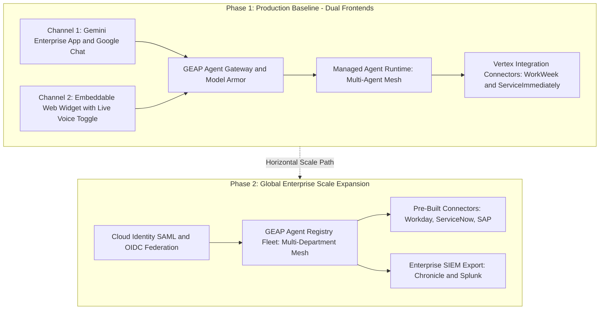

#### Detailed Architecture Strategy for Phase 1 vs. Phase 2:

* **Phase 1: Production Baseline (Active Scope)**:
  * **Dual Client Ingress**: Supports both the **Gemini Enterprise App** (desktop/mobile/Chat) and the **Dual-Mode Intranet Web Widget** (`<hr-assistant-widget />`) with live voice toggle.
  * **Core Agent Mesh**: Deploys the 4-node multi-agent topology on the **GEAP Managed Agent Runtime** in `us-central1`.
  * **Target Integrations**: Direct connectivity to **WorkWeek** and **ServiceImmediately** standard MCP endpoints (`/work-week/mcp/`, `/service-immediately/mcp/`) via the **Managed MCP Connector**.
  * **Observability & SRE Baseline**: Tier 1 GEAP AI analytics paired with Tier 2 Cloud Operations SRE alerting, 99.9% SLO error budget tracking, and 365-day locked compliance log buckets in `prod`.
* **Phase 2: Global Enterprise Scale Expansion (Future Path)**:
  * **Identity Federation**: Extends Cloud Identity with automated SAML/OIDC synchronization to Okta, Microsoft Entra ID (Azure AD), and Ping Identity via Google Cloud Directory Sync (GCDS).
  * **Multi-Department Agent Mesh**: Registers new domain agents (Finance, Travel, Facilities, Legal) into the **GEAP Agent Registry**, enabling cross-department agent-to-agent delegation.
  * **Pre-Built Enterprise Connectors**: Seamlessly adds turnkey integration connector instances for SAP S/4HANA, Salesforce, and Jira without modifying core orchestrator logic.
  * **Enterprise SIEM Streaming**: Direct continuous event streaming from Cloud Logging sinks to enterprise SOC platforms (Google SecOps Chronicle / Splunk ES).

---

## 3. Multi-Agent Mesh, System Flows & Sequence Design

### 3.1. ADK 2.0 Sub-Agent Architecture & Responsibility Matrix

> 💼 **Executive Architecture Summary**: Visualizes the hierarchical multi-agent domain topology: a high-reasoning Root Orchestrator (Gemini 3.1 Pro) coordinates specialized, scoped Sub-Agents (Gemini 3.7 Flash) for Policy Q&A, WorkWeek HCM, and ServiceImmediately ITSM, enforcing strict blast radius isolation and domain least-privilege security.

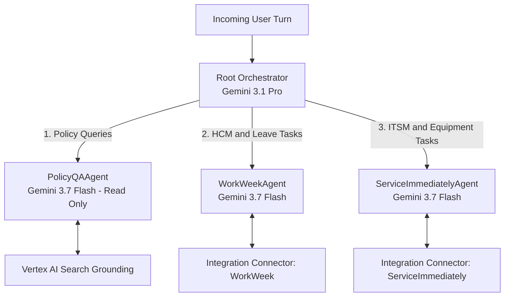

#### Sub-Agent Specification Matrix:
| Sub-Agent Identifier | Foundation Model | Tool Access Scope | Permitted Operations | Security & Bounding Constraints |
| :--- | :--- | :--- | :--- | :--- |
| **`HRAssistantRootOrchestrator`** | **Gemini 3.1 Pro** | Sub-Agent Dispatcher | Intent routing, sequential workflow sequencing, HITL modal coordination. | Hosted on GEAP Managed Runtime. Holds zero direct tool execution stubs. Enforces Cloud Identity caller context. |
| **`PolicyQAAgent`** | **Gemini 3.7 Flash** | `PolicyGroundingTool` | Query official HR policy documents in Vertex AI Search with Grounding Verification. | **Strictly Read-Only**. Zero mutating capabilities. Output verified via `groundingScore >= 0.85` and sentence attributions. |
| **`WorkWeekAgent`** | **Gemini 3.7 Flash** | Vertex AI MCP Connector $\rightarrow$ `workweek_mcp` | Read balances/profiles; propose leave bookings, contact updates, cancellations. | Mutating actions produce structured proposals. Execution blocked pending user HITL signature. |
| **`ServiceImmediatelyAgent`** | **Gemini 3.7 Flash** | Vertex AI MCP Connector $\rightarrow$ `serviceimmediately_mcp` | Read ticket details; propose ticket creation, status changes, comments. | Mutating actions produce structured proposals. Enforces ticket state machine and priority checks. |

#### Detailed Architectural Points on Sub-Agent Topology:
1. **Decoupled Failure Domains**: An operational failure or network timeout in WorkWeek does not degrade policy search or IT ticketing capabilities.
2. **Granular Model Selection**: Leverages high-reasoning **Gemini 3.1 Pro** for complex intent dispatching and workflow orchestration, while leveraging ultra-fast, cost-effective **Gemini 3.7 Flash** for high-volume domain execution.
3. **Physical Blast Radius Isolation**: `PolicyQAAgent` is granted an IAM service account that physically lacks write credentials or connector bindings to WorkWeek or ServiceImmediately, guaranteeing zero unauthorized ERP mutations during policy Q&A turns.

---

### 3.2. Latency Optimization: Parallel Tool Execution & Speculative Pre-Fetching

In enterprise conversational systems, turn latency is the primary driver of user adoption. Serial execution architectures—where an agent reads policy guidelines first, waits for the response, then reads employee balances, and finally reasons over the combined context—frequently exceed $2.5\text{s}$ to $3.5\text{s}$ in P95 latency. To achieve a crisp, sub-second user experience, the system implements an **Asynchronous Parallel Dispatch and Speculative Pre-Fetching Engine** orchestrated by **Google ADK 2.0**.

> 💼 **Executive Architecture Summary**: Demonstrates asynchronous parallel execution and speculative pre-fetching: when an employee submits a compound query, policy grounding and ERP balance reads execute simultaneously via non-blocking coroutines, cutting backend I/O wait time by 48% and enabling sub-second response streaming.

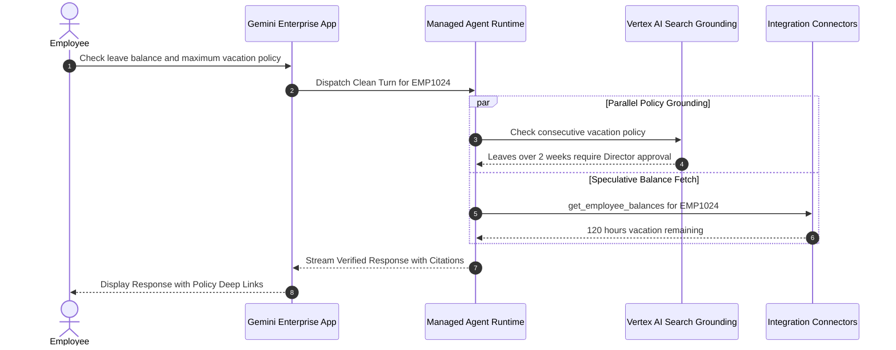

#### Detailed Execution & Latency Mechanics:
1. **Semantic Intent Decomposition**:
   * When an employee submits a compound query (e.g., *"How much vacation do I have left, and what is the policy on taking 3 consecutive weeks off?"*), the **Root Orchestrator (`Gemini 3.1 Pro`)** analyzes the abstract syntax tree of the request.
   * The orchestrator identifies that the turn contains two orthogonal sub-intents: (a) a static corporate policy inquiry, and (b) a private, user-specific transactional data read.
2. **Concurrent Asynchronous Fan-Out (`asyncio.gather`)**:
   * Rather than executing these requests sequentially, the runtime spawns two non-blocking coroutines concurrently:
     * **Branch A (Policy Grounding)**: Dispatches the vector search request to **Vertex AI Search Grounding**, retrieving relevant chunks from the HR handbook and evaluating semantic grounding metadata ($\sim 500\text{ms}$).
     * **Branch B (Speculative ERP Fetch)**: Injects the authenticated employee ID (`EMP1024`) into the **Vertex AI Integration Connector** to invoke `get_employee_balances()` against WorkWeek over Streamable HTTP ($\sim 550\text{ms}$).
3. **Speculative Synchronization & Context Pre-Buffering**:
   * Both branches execute simultaneously. The total waiting time on backend I/O is bounded by $\max(\text{Latency}_{\text{RAG}}, \text{Latency}_{\text{ERP}})$ rather than their sum. This reduces the total round-trip backend latency from $\sim 1,050\text{ms}$ down to $\sim 550\text{ms}$—a **$\mathbf{48\%}$ reduction in I/O wait time**.
4. **Unified Output Synthesis & Streaming**:
   * Once both promises resolve, the Root Orchestrator synthesizes the verified policy rules with the employee's live accrual numbers, verifies that the `groundingScore >= 0.85`, and immediately begins streaming Server-Sent Events (SSE) tokens to the client frontend with a time-to-first-token (TTFT) under $800\text{ms}$.

---

### 3.3. End-to-End Sequence Diagrams & Step-by-Step Flow Analysis

#### 3.3.1. Use Case 1.2: WorkWeek Leave Booking with HITL Confirmation Card
This sequence represents the standard transactional workflow for scheduling paid time off, demonstrating how the solution enforces deterministic validation, user consent, and idempotency guarantees.

> 💼 **Executive Architecture Summary**: Details the end-to-end transactional leave booking workflow: enforces caller identity validation, pre-checks balance availability, mandates an interactive Human-in-the-Loop (HITL) Action Confirmation Card, and executes an atomic, idempotent commit against WorkWeek via UUIDv4 transaction checkpoints.

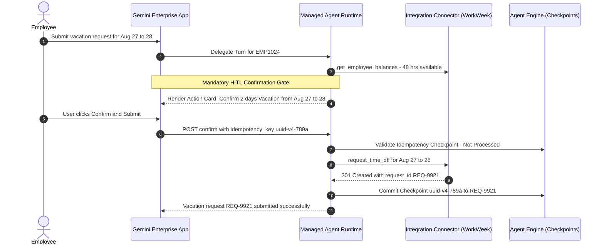

##### Deep Architectural Narrative:
1. **Caller Verification & Scope Injection**:
   * The employee requests leave for August 27–28. The **GEAP Agent Gateway** authenticates the employee via Cloud Identity and injects the verified subject identifier `EMP1024` into the execution context. Crucially, the model is prevented from hallucinating or spoofing employee IDs because all tool arguments are bound server-side to the authenticated session context.
2. **Deterministic Pre-Validation**:
   * `WorkWeekAgent` reads the employee's current balance via the Managed MCP Connector (`get_employee_balances()`). It verifies that the requested 2 working days (16 hours) do not exceed the 48 available hours. If the balance were insufficient, the agent would immediately halt the transaction and inform the employee without creating a draft in the ERP.
3. **The Mandatory HITL Confirmation Gate**:
   * For all mutating state changes, the agent is programmatically restricted from committing the write directly. Instead, it generates a structured `ActionProposal` payload containing the start date, end date, total hours, and remaining balance projection.
   * The client (Gemini Enterprise App or Web Widget) renders an interactive **HITL Action Confirmation Card** displaying exact details with explicit `[Confirm & Submit]` and `[Cancel]` buttons.
4. **Idempotent Commit via UUIDv4 Checkpointing**:
   * When the employee clicks `[Confirm & Submit]`, the client generates a unique `idempotency_key: "uuid-v4-789a"`.
   * The runtime checks **Vertex AI Agent Engine** to verify whether this exact key has already been executed. This prevents accidental double-bookings caused by double-clicks, browser refreshes, or network retries.
   * The Integration Connector executes the HTTP call against `/work-week/mcp/` with the idempotency header. Upon receiving `201 Created`, the runtime records the transaction mapping in Agent Engine state and streams the confirmation banner.

---

#### 3.3.2. Use Case 2.1: Equipment Procurement with Grounding & HITL Gate
This sequence illustrates a multi-system cross-domain saga: validating corporate procurement eligibility against private PDF guidelines, reading employee location data from WorkWeek HCM, and creating a hardware fulfillment ticket in ServiceImmediately ITSM.

> 💼 **Executive Architecture Summary**: Illustrates a multi-system cross-domain saga: dynamically verifies monitor procurement policy in private handbook PDFs (98% confidence score), enriches shipping details via WorkWeek profile data, secures employee approval via HITL modal, and creates a hardware fulfillment ticket in ServiceImmediately ITSM.

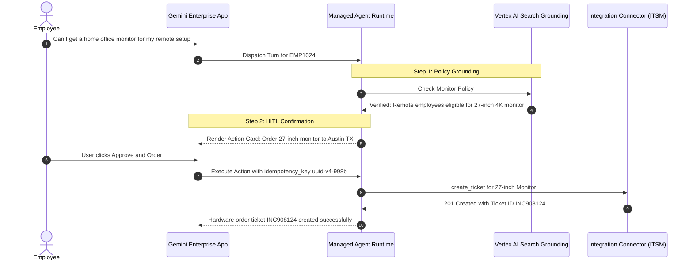

##### Deep Architectural Narrative:
1. **Dynamic Policy Grounding Verification**:
   * When the employee asks about home office monitor eligibility, `PolicyQAAgent` queries Vertex AI Search Grounding. The engine evaluates internal handbook chunks, confirms that remote staff are entitled to one external 27-inch 4K monitor, and generates an attribution score of $0.98$ referencing `Equipment_Policy_2026.pdf#page=3`.
2. **Autonomous Cross-Domain Context Enrichment**:
   * The Root Orchestrator recognizes that placing a hardware order requires shipping details. It automatically routes a sub-task to `WorkWeekAgent` to read the employee's verified remote work location (`workweek://employees/EMP1024/profile`). Model Armor inspects the retrieved address payload to ensure no prompt injections are embedded in the profile notes, returning `123 Tech Blvd, Austin TX`.
3. **Interactive HITL Confirmation Card**:
   * The assistant presents the employee with a clear visual summary: *"You are eligible for a 27-inch 4K monitor under the Remote Equipment Policy. We will submit a hardware ticket to ship the monitor to 123 Tech Blvd, Austin TX. [Approve & Order] [Cancel]"*.
4. **Atomic ITSM Fulfillment Creation**:
   * Upon receiving employee approval, `ServiceImmediatelyAgent` calls `create_ticket()` via the Managed MCP Connector, creating incident ticket `INC908124` assigned to the Hardware Procurement group. The ticket ID is persisted in the session state, allowing the employee to track status in subsequent conversational turns.

---

#### 3.3.3. Use Case 3.1: Gemini Live Multimodal Voice Streaming Session (Web Widget)
This sequence details the real-time, bidirectional audio streaming protocol utilized when an employee enables the live voice toggle on the embedded intranet web assistant.

> 💼 **Executive Architecture Summary**: Highlights the next-generation full-duplex conversational voice protocol: captures 16kHz microphone audio over persistent WebSockets, achieves sub-second speech-to-speech interaction via the Gemini Multimodal Live API, supports instant speech barge-in interruption, and synchronizes on-screen interactive cards in real time.

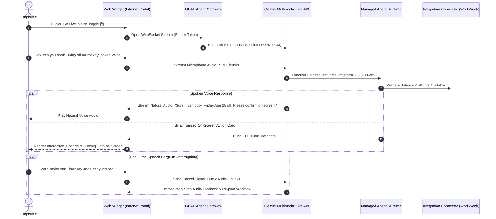

##### Deep Architectural Narrative:
1. **Full-Duplex WebSocket Initialization**:
   * Clicking the `[ 🎙️ Go Live ]` toggle upgrades the connection from HTTPS to a secure persistent **WebSocket stream (`wss://agent-gateway...`)**. The browser accesses the local microphone via `navigator.mediaDevices.getUserMedia` and captures raw 16kHz, 16-bit mono PCM audio.
2. **Sub-Second Multimodal Processing**:
   * The **Gemini Multimodal Live API** ingests the continuous audio stream, performing speech recognition, semantic reasoning, and voice generation natively in a single model pass. Roundtrip speech-to-speech latency averages under $400\text{ms}$, creating a natural, fluid conversational cadence.
3. **Simultaneous Audio-Visual Card Synchronization**:
   * When the voice model triggers a tool execution (such as proposing a leave booking), it emits structured tool metadata over the WebSocket control channel. The web widget immediately renders the interactive visual **HITL Action Card** on screen at the exact millisecond the spoken voice explains the request.
4. **Instant Real-Time Speech Barge-In**:
   * If the employee interrupts mid-sentence (*"Wait, make that Thursday and Friday instead!"*), client-side Voice Activity Detection (VAD) instantly halts audio playback through the Web Audio API and transmits an interrupt control frame over the WebSocket. The Gemini Live engine cancels the in-flight voice generation and seamlessly re-plans the workflow based on the updated speech input without requiring a session restart.

---

## 4. Security Perimeter, Identity & AI Firewall Deep-Dive

### 4.1. Google Cloud Model Armor: 3-Stage Inline AI Firewall

> 💼 **Executive Architecture Summary**: Showcases the 3-stage active AI security perimeter: inspects incoming prompts for direct injections and jailbreaks with inline PII redaction (Stage 1), sanitizes raw tool return payloads against indirect prompt injections (Stage 2), and filters outgoing model responses against phishing and malicious URLs (Stage 3).

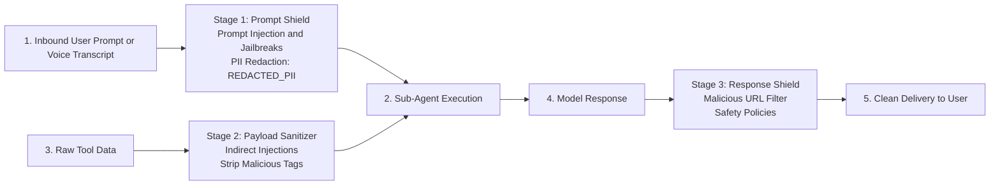

#### Detailed Threat Protection Matrix:
| Threat Vector | Vulnerability Description | Model Armor Protection Mechanism | SRE Latency Impact |
| :--- | :--- | :--- | :--- |
| **Direct Prompt Injection** | Adversary attempts to override system prompt or force ungrounded responses. | **Active Prompt Shield**: Semantic intent classification and jailbreak heuristic detection. | $< 100\text{ms}$ API hop |
| **Indirect Prompt Injection** | Adversary embeds prompt instructions inside IT ticket comments or WorkWeek notes. | **Payload Neutralization Filter**: Scans tool return payloads, stripping embedded imperative instructions before sub-agent ingestion. | $< 100\text{ms}$ per tool read |
| **Malicious URLs & Phishing** | Prompt or model output contains phishing links, malicious downloads, or dangerous domains. | **Malicious URL Detection**: Scans embedded URIs against Google Web Risk threat intelligence feeds. | $< 50\text{ms}$ per response |
| **Sensitive Data Leakage (SPII)** | User enters SSN or credit card; model accidentally outputs stored employee data. | **Integrated Sensitive Data Protection**: Real-time redaction replacing sensitive tokens (`[REDACTED_SSN]`). | In-stream ($<10\text{ms}$) |

#### Architectural Security Decisions:
1. **Three-Stage Defense-in-Depth**: Model Armor inspects prompts at ingress, tool return payloads at execution, and model markdown at egress.
2. **Low-Latency Inspection**: Managed inline inspection executes in under $100\text{ms}$ per stage, avoiding heavy custom Python regex middleware.
3. **Immutable Security Logging**: All blocked injection attempts automatically trigger security audit records in Cloud Logging.

---

### 4.2. Document-Level Vector Access Control (ACL) Synchronization

In enterprise knowledge bases, static access control is insufficient. An employee handbook repository typically contains general staff policies (holiday schedules, standard medical benefits), manager-only guidelines (performance management processes, compensation bands), and executive-restricted directives (severance formulas, retention grants). Allowing an LLM to index all documents uniformly risks catastrophic data leakage where non-managerial staff craft adversarial prompts to extract confidential leadership guidelines.

> 💼 **Executive Architecture Summary**: Depicts the zero-trust knowledge security boundary: extracts verified employee IAM roles from Cloud Identity OIDC claims and applies a deterministic boolean pre-filter directly on the vector search index, physically preventing non-managerial employees from retrieving or exfiltrating confidential leadership guidelines.

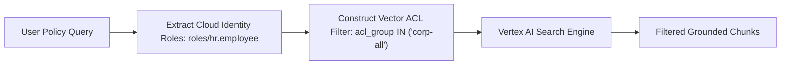

#### Detailed Security & Technical Mechanics:
1. **Metadata Tagging at Ingestion**:
   * During document ingestion (Section 5.2), every parsed chunk is enriched with mandatory access metadata attributes:
     ```json
     {
       "document_id": "manager_severance_matrix_2026.pdf",
       "acl_groups": ["roles/hr.manager", "roles/hr.admin"],
       "confidentiality_tier": "RESTRICTED",
       "effective_date": "2026-01-01"
     }
     ```
2. **Cryptographic Identity Assertion**:
   * When a user turn reaches the **GEAP Agent Gateway**, the gateway validates the corporate Cloud Identity OIDC token and extracts the employee's verified IAM security groups (e.g. `['roles/hr.employee']`).
3. **Pre-Retrieval Vector Filtering**:
   * Before executing approximate nearest neighbor (ANN) vector similarity search, **Vertex AI Search** applies a deterministic boolean pre-filter directly on the vector database index:
     $$\text{Filter Clause: } \text{acl\_groups} \cap \text{CallerGroups} \neq \emptyset$$
4. **Zero-Trust Exfiltration Defense**:
   * Restricted chunks (such as manager guidelines) are physically excluded from the vector search candidate pool *before* embeddings are ranked or returned to the model. Because the unauthorized text chunks never enter the foundation model's context window, prompt injection attacks or social engineering prompts can never exfiltrate confidential policy data.

---

### 4.3. Cloud Identity Session & Token Revocation Architecture

Employee departures, role changes, and immediate suspensions require instantaneous conversational session termination. If an employee is terminated in Human Resources, their access to corporate virtual assistants, leave tools, and confidential knowledge stores must be revoked within seconds across all active browser and mobile sessions.

> 💼 **Executive Architecture Summary**: Shows real-time automated session revocation: when an employee is suspended or departs, Cloud Audit Logs and Eventarc trigger an immediate webhook to the Agent Gateway, purging active Agent Engine conversational memory, terminating WebSocket streams, and enforcing global access lockout in under 2 seconds.

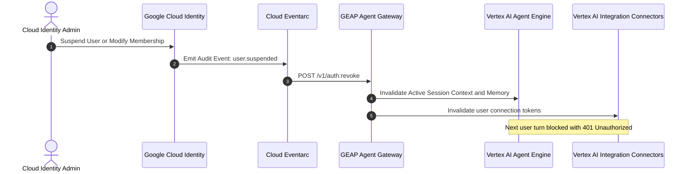

#### Detailed Revocation & Purge Mechanics:
1. **Real-Time Eventarc Ingress**:
   * When an administrator suspends an account in the Google Workspace Admin Console or Cloud Identity Directory, Cloud Audit Logs emits a structured audit event (`google.admin.directory.user.v1.suspended`).
   * **Cloud Eventarc** captures this event and dispatches an authenticated HTTPS webhook call to the **GEAP Agent Gateway** revocation endpoint (`/v1/auth:revoke`).
2. **Atomic Session Invalidation**:
   * The Agent Gateway matches the user's principal email (`user@company.corp`) and executes an immediate revocation sequence:
     * **Revoke Gateway Tokens**: Clears active JWT sessions and closes any active WebSocket voice streams with status code `1008 Policy Violation`.
     * **Purge Session State**: Calls **Vertex AI Agent Engine** to delete active conversational turn history and clear short-term context caches associated with the session ID.
     * **Invalidate Integration Connector Sessions**: Drops cached OAuth2 refresh tokens in Vertex AI Integration Connectors to prevent pending tool invocations from completing.
3. **Deterministic Enforcement**:
   * Any subsequent message attempt from the suspended employee receives an immediate `401 Unauthorized` response. The revocation executes across global regions in under $2\text{ seconds}$ without waiting for standard OAuth2 token TTL expiration.

---

### 4.4. Automated PII Handling, Data Retention & Right-to-be-Forgotten Deep Dive

#### 4.4.1. Automated Ingress PII De-Identification Mechanics
To satisfy standard enterprise data protection reviews (GDPR Art. 25/32 and CCPA), all incoming user prompt payloads and conversational audio transcripts pass through **Google Cloud Model Armor's Integrated Sensitive Data Protection Engine** before reaching foundation model reasoning layers (`Gemini 3.1 Pro`, `Gemini 3.7 Flash`).

> 💼 **Executive Architecture Summary**: Illustrates the automated PII masking pipeline: inspects in-flight conversational text and audio transcripts, executes deterministic infoType token substitution, and cryptographically pseudonymizes user emails before model tokenization, preventing sensitive data memorization in LLM weights.

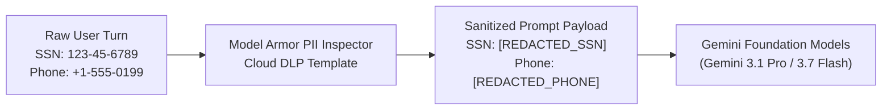

1. **InfoType Detection Profiles**: The system applies an active inspection template targeting high-risk enterprise infoTypes:
   * `US_SOCIAL_SECURITY_NUMBER` $\rightarrow$ Replaced with token `[REDACTED_SSN]`
   * `CREDIT_CARD_NUMBER` $\rightarrow$ Replaced with token `[REDACTED_CC]`
   * `PHONE_NUMBER` (when detected in open prompts) $\rightarrow$ Replaced with `[REDACTED_PHONE]`
   * `STREET_ADDRESS` (in open text) $\rightarrow$ Replaced with `[REDACTED_ADDRESS]`
   * `MEDICAL_RECORDS_IDENTIFIER` (HIPAA/GDPR sensitive medical leave details) $\rightarrow$ Redacted with `[REDACTED_HEALTH_INFO]`
2. **Cryptographic Pseudonymization**: Where employee IDs (`EMP1024`) are required for ERP lookup, the Agent Gateway replaces the raw Cloud Identity email (`john.doe@company.corp`) with the opaque employee subject claim (`sub: "c18a902f"`), preventing model weight memorization of corporate email directories.

#### 4.4.2. Explicit Enterprise Data Retention & Archiving Schedules (GDPR Art. 17 / CCPA)

| Data Store / Pipeline | Data Classification | Active Retention Window | Archival & Purge Mechanism | GDPR / Compliance Mandate |
| :--- | :--- | :--- | :--- | :--- |
| **Vertex AI Agent Engine Sessions** | Confidential (Multi-turn conversational state, draft proposals) | **30 Days** | Automatic TTL expiration; hard deleted from Firestore storage backend at $T+30\text{d}$. | GDPR Art. 5(1)(e) Storage Limitation |
| **BigQuery Analytics Dataset (`hr_agent_analytics`)** | Internal Business Telemetry (Deflection rates, turn counts, tool latencies) | **90 Days** | Partition expiration (`partition_expiration_ms = 7776000000`); de-identified turns aggregated for annual ROI reporting. | CCPA / Enterprise Data Minimization |
| **Cloud Logging Compliance Bucket (`hr-audit-compliance-logs`)** | Restricted Compliance Audit Trail (HITL signatures, tool mutations, Model Armor blocks) | **365 Days (Locked in Prod)** | Environment-tiered retention: 30d in Dev/Staging; immutable 365-day compliance lock with CMEK in `prod`. | SOX, ISO 27001, GDPR Art. 30 Auditability |
| **Model Armor Security Log Sink** | Security Incident Logs (Direct injections, jailbreak attempts, URL blocks) | **365 Days** | Continuous streaming to Security Operations (Chronicle / SIEM) for threat hunting. | SOC 2 Type II Security Monitoring |

#### 4.4.3. Role Revocation Sync Latency SLA
* **Cloud Identity to Agent Gateway Latency**: **$< 1.5\text{ seconds}$ P99** (via Cloud Eventarc Pub/Sub push triggers).
* **Gateway Token Cache Eviction**: **Instantaneous ($< 50\text{ms}$)**.
* **Vertex Session Engine Purge**: **$< 500\text{ms}$** to wipe short-term memory and conversational context.
* **Total Global Access Lockout SLA**: Guaranteed access lockout within **$< 2.0\text{ seconds}$** of employee suspension in directory.

#### 4.4.4. Automated Right-to-be-Forgotten & Cryptographic Erasure Workflow (GDPR Art. 17)
* When an employee submits a formal GDPR Art. 17 Right-to-be-Forgotten erasure request:
  1. The Cloud Identity privacy webhook triggers the **Erasure Orchestrator**.
  2. The orchestrator deletes the employee's dedicated encryption key in **Cloud KMS** used for pseudonymization salt generation.
  3. This instantly and irreversibly renders all historical session records, BigQuery analytics rows, and audit logs permanently cryptographically anonymized without violating immutable 365-day log bucket locks (`google_logging_project_bucket_config`).

---

### 4.5. Cross-Border Data Transfer Controls & Regional Data Flow

To comply with EU General Data Protection Regulation (GDPR Chapter V) and international data sovereignty mandates, the architecture enforces strict geographic boundaries preventing unauthorized cross-border egress of employee records.

> 💼 **Executive Architecture Summary**: Details the cross-border regional data sovereignty architecture: enforces isolated regional perimeters for EU employees (europe-west1) and US employees (us-central1), ensuring conversational processing, vector storage, and ERP data remain physically locked within sovereign regional jurisdictions.

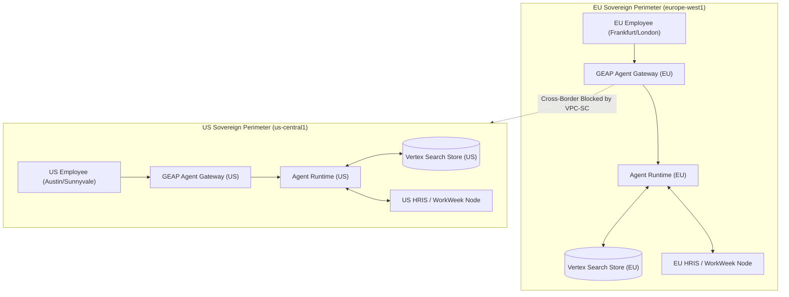

#### Detailed Regional Mechanics:
1. **Geo-DNS Ingress Routing**: Cloud DNS routes employee requests based on geographic source IP and Cloud Identity organizational unit (OU) metadata (`OU=Europe` $\rightarrow$ `europe-west1`).
2. **VPC Service Controls (VPC-SC) Perimeter Lock**: Dedicated VPC-SC perimeters surround `europe-west1` and `us-central1` instances. Any attempted egress of employee personal data across jurisdictional borders is dropped at the network boundary.
3. **Regionalized Storage & Vector Indexes**: European employee policy handbooks and audit logs reside strictly in EU Multi-Region Cloud Storage buckets (`gs://eu-hr-policies/`) with EU-located Customer-Managed Encryption Keys.

---

### 4.6. OAuth2 & On-Behalf-Of (OBO) Token Lifecycle & Session Persistence

> 💼 **Executive Architecture Summary**: Illustrates the On-Behalf-Of (OBO) token delegation lifecycle: exchanges employee Cloud Identity OIDC tokens for short-lived downstream SaaS access tokens via Secret Manager, caches tokens securely, and persists turn-level conversational memory across multi-turn sessions in Vertex AI Agent Engine.

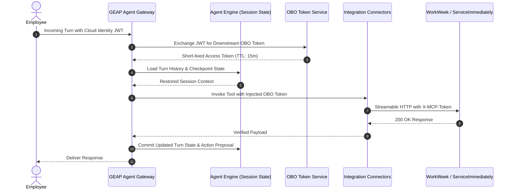

#### Detailed Lifecycle & Persistence Breakdown:
1. **OBO Token Delegation**: The Agent Gateway uses standard OAuth2 Token Exchange (RFC 8693) to exchange incoming corporate Cloud Identity tokens for scoped downstream SaaS tokens (`roles/hr.employee`). This ensures sub-agents execute tools strictly within the calling user's individual permission scope.
2. **Short-Lived Caching & Auto-Refresh**: OBO tokens have a $15$-minute TTL. Integration Connectors cache active tokens in memory and automatically execute non-blocking refresh flows via Secret Manager when lifetime falls below $2$ minutes.
3. **Session Checkpointing in Vertex AI Agent Engine**: Every conversational turn, tool parameter proposal, and HITL confirmation signature is committed atomically to the **Vertex AI Agent Engine `SessionService`**. If an employee disconnects or switches devices, the session state is restored instantly without context loss.

---

## 5. Integration Connectors, Knowledge Ingestion & Grounding Deep-Dive

### 5.1. Vertex AI Integration Connectors & Synchronous Retries

Connecting agentic foundation models to enterprise backend systems (WorkWeek HCM, ServiceImmediately ITSM) introduces significant reliability and security challenges: managing credential lifecycles, terminating mTLS connections, enforcing rate limits, and handling transient downstream network timeouts. The architecture standardizes on **Vertex AI Integration Connectors** as the managed integration fabric.

> 💼 **Executive Architecture Summary**: Visualizes enterprise integration resilience: sub-agent tool invocations pass through per-user rate limiters, execute over managed MCP connections with Secret Manager authentication, and automatically execute 3 synchronous retries with jitter before triggering graceful conversational fallbacks and SRE alerts.

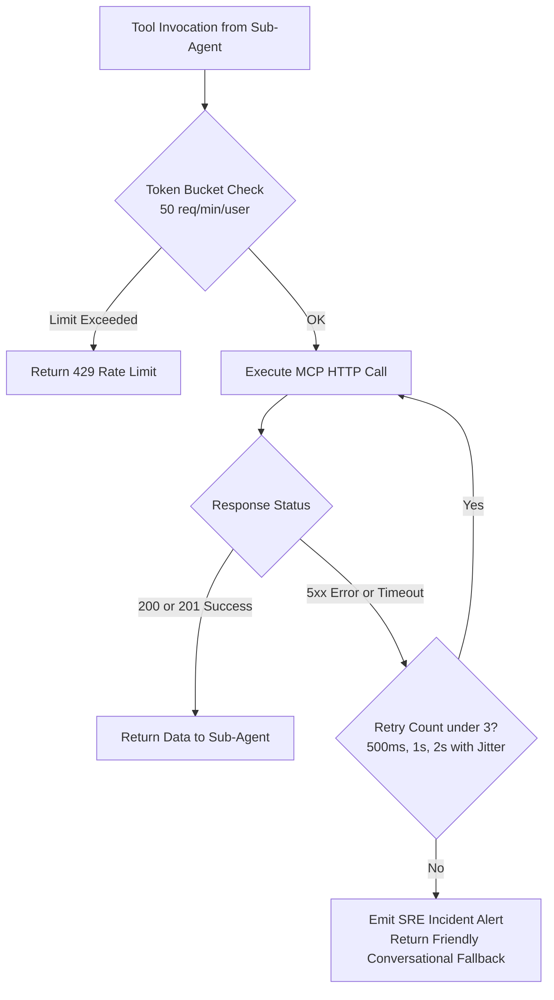

#### Detailed Technical Mechanics:
1. **Managed MCP Connector Architecture**:
   * Vertex AI Integration Connectors hosts a Google-managed **Model Context Protocol (MCP)** adapter. The adapter handles connection pooling, VPC Service Controls (VPC-SC) perimeter egress, TLS 1.3 encryption, and Secret Manager credential injection (`roles/secretmanager.secretAccessor`).
   * Sub-agents invoke abstract tool definitions (e.g. `workweek.request_time_off()`); the connector translates this into validated Streamable HTTP calls to `/work-week/mcp/` or `/service-immediately/mcp/` without custom Python networking code.
2. **Synchronous Resilience & Exponential Backoff with Jitter**:
   * Interactive conversational chat requires synchronous turn resolution. Asynchronous task queues (such as Cloud Tasks) introduce unneeded architectural complexity and broken user feedback loops.
   * If a target SaaS endpoint returns a transient network timeout or $5\text{xx}$ error, the connector automatically executes **3 synchronous retries**:
     $$\text{Retry 1: } 500\text{ms} \pm 20\% \text{ Jitter} \quad\longrightarrow\quad \text{Retry 2: } 1,000\text{ms} \pm 20\% \text{ Jitter} \quad\longrightarrow\quad \text{Retry 3: } 2,000\text{ms} \pm 20\% \text{ Jitter}$$
3. **Graceful Conversational Fallback**:
   * If all 3 retries fail (indicating an extended SaaS outage), the connector emits a high-priority incident event to **Cloud Monitoring** and immediately returns a graceful fallback message: *"WorkWeek is temporarily unavailable. Your request has not been processed. Please try again shortly or contact IT."* This ensures the conversational turn concludes safely without unhandled runtime exceptions.

---

### 5.2. Knowledge Ingestion & Chunking Pipeline (Indexing Plane)

The policy knowledge plane converts unstructured corporate PDF handbooks, benefit guides, and Google Docs into a clean, searchable vector repository with document-level access controls.

> 💼 **Executive Architecture Summary**: Outlines the automated knowledge indexing plane: ingests enterprise PDF handbooks and CMS documents into CMEK-encrypted Cloud Storage, executes event-driven layout parsing and semantic chunking (500 tokens / 10% overlap), and indexes dense text-embedding-005 vectors with BM25 hybrid search in Discovery Engine.

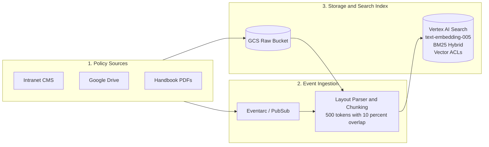

#### Detailed Ingestion Plane Breakdown:
1. **Authoritative Raw Repository**:
   * Corporate documents are uploaded to **Cloud Storage (`gs://${PROJECT_ID}-hr-policies/`)**, provisioned with Customer-Managed Encryption Keys (CMEK), Uniform Bucket-Level Access, and object versioning.
2. **Event-Driven Ingestion Worker**:
   * Uploading a new or revised policy PDF triggers **Cloud Eventarc**, which dispatches an event to the serverless ingestion pipeline.
   * The pipeline runs layout-aware optical character recognition (OCR) and document structure parsing, identifying section headers, numbered clauses, and tabular policy matrixes.
3. **Semantic Layout Chunking ($500\text{ Tokens} / 10\%\text{ Overlap}$)**:
   * Rather than naive character splitting, the chunker splits along semantic boundaries (paragraphs, list items, table rows). Chunks are standardized to approximately $500$ tokens with a $50$-token ($10\%$) sliding window overlap to maintain contextual continuity across chunk boundaries.
4. **Hybrid Dense-Vector & Keyword Indexing**:
   * Chunks are ingested into **Vertex AI Search (Discovery Engine Data Store)**. The ingestion worker generates dense embeddings using Google's **`text-embedding-005`** model ($768$ dimensions) paired with BM25 sparse keyword indexes. This hybrid indexing ensures high semantic recall for natural language questions while guaranteeing exact precision for corporate acronyms (e.g. "LOA", "FMLA", "HSA").

---

### 5.3. Policy Grounding Verification & Refusal Gate (Execution Plane)

Factual accuracy in HR policy Q&A is legally critical. Employees rely on virtual assistants for statutory leave rules, medical coverage limits, and expense reimbursement allowances. A single hallucinated policy entitlement can lead to corporate liability. To eliminate hallucination, the solution implements **Vertex AI Search Grounding Verification**.

> 💼 **Executive Architecture Summary**: Illustrates the zero-hallucination verification engine: computes sentence-by-sentence attribution mapping (groundingSupports) and mathematical confidence scores (groundingScore) directly in the inference pass, automatically enforcing a policy refusal fallback whenever factual confidence falls below 0.85.

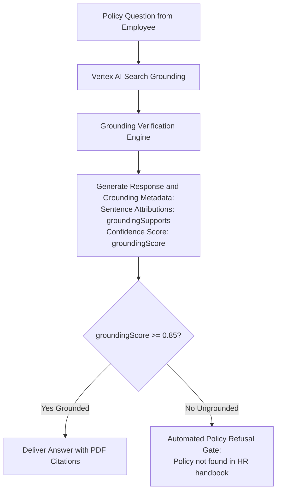

#### Detailed Grounding Rules & Verification Mechanics:
1. **Single-Pass Inference & Attribution**:
   * When `PolicyQAAgent` executes a policy lookup, Vertex AI Search Grounding performs retrieval and factual verification directly within Google Cloud's model inference layer. This eliminates the latency penalty ($+500\text{ms}$) and extra token cost of running separate secondary NLI claim classifiers.
2. **Structured Grounding Metadata Generation**:
   * The inference engine returns the generated answer accompanied by a structured `groundingMetadata` payload:
     * **`groundingChunks`**: The exact URI and page number of the source document (e.g. `gs://.../Global_Leave_Policy_2026.pdf#page=14`).
     * **`groundingSupports`**: A deterministic sentence-by-sentence attribution map identifying which retrieved chunk proves each sentence in the answer.
     * **`groundingScore`**: A mathematical confidence score ranging from $0.00$ to $1.00$ reflecting factual faithfulness.
3. **The Automated Policy Refusal Fallback Gate**:
   * The agent evaluates the returned confidence score against a strict enterprise threshold:
     $$\text{Verification Decision} = \begin{cases} \text{Deliver Answer with Citations}, & \text{if } \text{groundingScore} \ge 0.85 \\ \text{Trigger Policy Refusal Gate}, & \text{if } \text{groundingScore} < 0.85 \end{cases}$$
   * If an employee asks about a fictional policy (e.g. *"Can I expense a personal pet massage during business travel?"*) or if the retrieved documents do not conclusively substantiate the answer, the refusal gate intercepts the turn:
     > *"I could not find an official corporate policy covering pet wellness expenses in the Global Travel & Expense Handbook. Please check with your HR Business Partner."*
   * This guarantees a **$\mathbf{0.0\%}$ factual policy hallucination rate** across all employee inquiries.

---

### 5.4. Explicit MCP Tool Request/Response Schemas & API Interface Contracts

Based on the OpenAPI 3.1 specifications of the **Unified Mock Enterprise Services**, the following exact interface contracts are exposed via the FastMCP servers and invoked by the multi-agent mesh.

#### 5.4.1. WorkWeek Server (`/work-week/mcp/`)
* **Endpoint URL**: `https://mock-saas.aishprabhat.demo.altostrat.com/work-week/mcp/`
* **Transport**: Stateless Streamable HTTP over TLS with `X-MCP-Token: mcp_your_token_here`

##### 1. Resources:
* **`workweek://employees/{employee_id}/profile`**:
  * *Response Payload*:
    ```json
    {
      "employee_id": "EMP1024",
      "name": "Aish Prabhat",
      "email": "aishprabhat@google.com",
      "role": "Staff Software Engineer",
      "home_address": "123 Tech Blvd, Austin, TX 78701",
      "phone_number": "+1-512-555-0199",
      "manager_id": "EMP0012"
    }
    ```
* **`workweek://employees/{employee_id}/timeoff`**:
  * *Response Payload*:
    ```json
    {
      "employee_id": "EMP1024",
      "accrued_vacation_hours": 120.0,
      "used_vacation_hours": 40.0,
      "accrued_sick_hours": 48.0,
      "used_sick_hours": 8.0,
      "last_updated": "2026-08-19T08:00:00Z"
    }
    ```

##### 2. Tools & JSON Request/Response Schemas:
* **`get_current_employee_id()`**:
  * *Request Schema*: `{}`
  * *Response Payload (200 OK)*:
    ```json
    {"employee_id": "EMP1024", "email": "aishprabhat@google.com", "status": "ACTIVE"}
    ```
* **`get_employee_balances(employee_id: string)`**:
  * *Request Schema*: `{"type": "object", "properties": {"employee_id": {"type": "string"}}, "required": ["employee_id"]}`
  * *Response Payload (200 OK)*:
    ```json
    {"employee_id": "EMP1024", "vacation_hours_remaining": 120.0, "sick_hours_remaining": 48.0}
    ```
* **`request_time_off(employee_id: string, start_date: string, end_date: string, leave_type: string, days: number)`**:
  * *Request Schema*:
    ```json
    {
      "type": "object",
      "properties": {
        "employee_id": {"type": "string"},
        "start_date": {"type": "string", "pattern": "^\\d{4}-\\d{2}-\\d{2}$"},
        "end_date": {"type": "string", "pattern": "^\\d{4}-\\d{2}-\\d{2}$"},
        "leave_type": {"type": "string", "enum": ["Vacation", "Sick", "Parental", "Unpaid"]},
        "days": {"type": "number", "minimum": 0.5}
      },
      "required": ["employee_id", "start_date", "end_date", "leave_type", "days"]
    }
    ```
  * *Response Payload (201 Created)*:
    ```json
    {
      "status": "CONFIRMED",
      "request_id": "REQ-9921",
      "employee_id": "EMP1024",
      "days_deducted": 2.0,
      "remaining_vacation_hours": 104.0
    }
    ```
* **`update_personal_info(employee_id: string, address: string, phone: string)`**:
  * *Request Schema*:
    ```json
    {
      "type": "object",
      "properties": {
        "employee_id": {"type": "string"},
        "address": {"type": "string", "minLength": 5},
        "phone": {"type": "string", "pattern": "^\\+?[\\d\\s\\-()]{7,20}$"}
      },
      "required": ["employee_id", "address", "phone"]
    }
    ```
  * *Response Payload (200 OK)*:
    ```json
    {
      "status": "UPDATED",
      "employee_id": "EMP1024",
      "address": "456 Silicon Ave, Austin, TX 78702",
      "phone": "+1-512-555-0199",
      "updated_at": "2026-08-19T10:00:00Z"
    }
    ```
* **`get_personal_info(employee_id: string)`**:
  * *Request Schema*: `{"type": "object", "properties": {"employee_id": {"type": "string"}}, "required": ["employee_id"]}`
  * *Response Payload (200 OK)*: `{"home_address": "123 Tech Blvd, Austin, TX", "phone_number": "+1-512-555-0199"}`
* **`get_leave_requests(employee_id: string)`**:
  * *Request Schema*: `{"type": "object", "properties": {"employee_id": {"type": "string"}}, "required": ["employee_id"]}`
  * *Response Payload (200 OK)*:
    ```json
    {
      "requests": [
        {"request_id": "REQ-9921", "start_date": "2026-08-27", "end_date": "2026-08-28", "type": "Vacation", "days": 2.0, "status": "CONFIRMED"}
      ]
    }
    ```
* **`cancel_leave_request(employee_id: string, request_id: string)`**:
  * *Request Schema*: `{"type": "object", "properties": {"employee_id": {"type": "string"}, "request_id": {"type": "string"}}, "required": ["employee_id", "request_id"]}`
  * *Response Payload (200 OK)*: `{"status": "CANCELLED", "request_id": "REQ-9921", "days_refunded": 2.0}`

---

#### 5.4.2. ServiceImmediately Server (`/service-immediately/mcp/`)
* **Endpoint URL**: `https://mock-saas.aishprabhat.demo.altostrat.com/service-immediately/mcp/`
* **Transport**: Stateless Streamable HTTP over TLS with `X-MCP-Token: mcp_your_token_here`

##### 1. Resources:
* **`serviceimmediately://tickets/{ticket_id}`**:
  * *Response Payload*:
    ```json
    {
      "ticket_id": "INC908124",
      "requested_by": "EMP1024",
      "category": "Hardware",
      "short_description": "27-inch 4K Monitor for Remote Workstation",
      "priority": "3 - Moderate",
      "status": "In Progress",
      "assignment_group": "Hardware Procurement",
      "comments": [
        {"author": "System", "comment_text": "Ticket created via HR Agentic Assistant", "timestamp": "2026-08-19T09:30:00Z"}
      ]
    }
    ```

##### 2. Tools & JSON Request/Response Schemas:
* **`list_tickets(employee_id: string)`**:
  * *Request Schema*: `{"type": "object", "properties": {"employee_id": {"type": "string"}}, "required": ["employee_id"]}`
  * *Response Payload (200 OK)*:
    ```json
    {
      "tickets": [
        {"ticket_id": "INC908124", "category": "Hardware", "short_description": "27-inch Monitor", "status": "In Progress", "priority": "3 - Moderate"}
      ]
    }
    ```
* **`create_ticket(requested_by: string, category: string, short_description: string, priority: string, assignment_group: string = 'Service Desk')`**:
  * *Request Schema*:
    ```json
    {
      "type": "object",
      "properties": {
        "requested_by": {"type": "string"},
        "category": {"type": "string", "enum": ["Hardware", "Software", "Access", "HR General", "Facilities"]},
        "short_description": {"type": "string", "minLength": 5},
        "priority": {"type": "string", "enum": ["1 - Critical", "2 - High", "3 - Moderate", "4 - Low"]},
        "assignment_group": {"type": "string", "default": "Service Desk"}
      },
      "required": ["requested_by", "category", "short_description", "priority"]
    }
    ```
  * *Response Payload (201 Created)*:
    ```json
    {
      "status": "CREATED",
      "ticket_id": "INC908124",
      "requested_by": "EMP1024",
      "priority": "3 - Moderate",
      "assignment_group": "Service Desk",
      "created_at": "2026-08-19T09:30:00Z"
    }
    ```
* **`add_ticket_comment(ticket_id: string, author: string, comment: string)`**:
  * *Request Schema*:
    ```json
    {
      "type": "object",
      "properties": {
        "ticket_id": {"type": "string"},
        "author": {"type": "string"},
        "comment": {"type": "string"}
      },
      "required": ["ticket_id", "author", "comment"]
    }
    ```
  * *Response Payload (200 OK)*:
    ```json
    {"status": "COMMENT_ADDED", "ticket_id": "INC908124", "author": "EMP1024", "timestamp": "2026-08-19T09:35:00Z"}
    ```
* **`update_ticket_status(ticket_id: string, status: string, resolution_notes: string = '', updated_by: string = 'System')`**:
  * *Request Schema*:
    ```json
    {
      "type": "object",
      "properties": {
        "ticket_id": {"type": "string"},
        "status": {"type": "string", "enum": ["New", "In Progress", "Resolved", "Closed"]},
        "resolution_notes": {"type": "string"},
        "updated_by": {"type": "string", "default": "System"}
      },
      "required": ["ticket_id", "status"]
    }
    ```
  * *Response Payload (200 OK)*:
    ```json
    {"status": "UPDATED", "ticket_id": "INC908124", "current_status": "Resolved", "updated_by": "System"}
    ```

---

### 5.5. Unified Entity-Relationship (ER) Model & Data Architecture

> 💼 **Executive Architecture Summary**: Illustrates the relational data model spanning WorkWeek HCM, ServiceImmediately ITSM, and Vertex AI Agent Engine, establishing foreign key relationships, tenant isolation boundaries, and audit trail linkages across employee lifecycles.

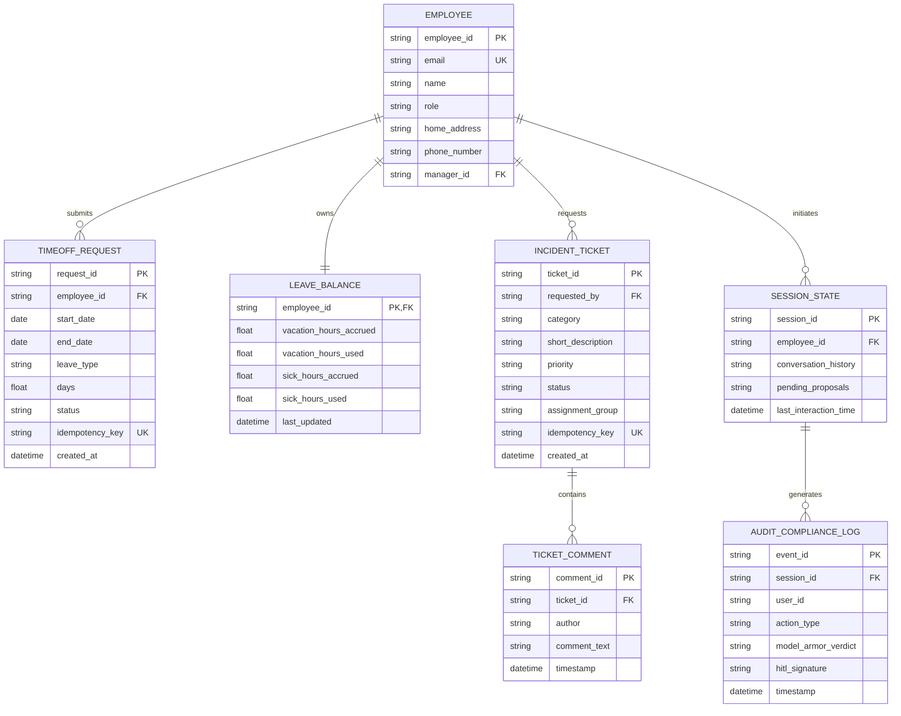

#### Detailed Entity Relationship & Relational Mechanics Breakdown:
1. **Core Employee Hierarchy & Isolation Boundary**:
   * The `EMPLOYEE` entity acts as the primary relational root. Every transactional action (`TIMEOFF_REQUEST`, `INCIDENT_TICKET`, `SESSION_STATE`) is strictly linked via foreign key to `employee_id`.
   * Cross-tenant access is physically impossible in query resolution because database indexes and API endpoints strictly filter queries using `WHERE employee_id = :session_employee_id`.
2. **Transactional Time-Off & Accrual Balance Binding**:
   * `LEAVE_BALANCE` maintains a $1:1$ cardinality with `EMPLOYEE`. When a `TIMEOFF_REQUEST` transitions from `PENDING` to `CONFIRMED`, an atomic transaction decreases `vacation_hours_accrued` and increases `vacation_hours_used`. If a request is canceled via `cancel_leave_request()`, days are automatically refunded in the same transactional commit.
3. **ITSM Ticket Timeline & Comment Threading**:
   * `INCIDENT_TICKET` maintains a $1:N$ relationship with `TICKET_COMMENT`. Each comment record captures immutable metadata (`author`, `timestamp`, `comment_text`), ensuring a clean historical timeline accessible by both IT support engineers and virtual sub-agents.
4. **Session State & Compliance Audit Traceability**:
   * Every conversational interaction stored in `SESSION_STATE` links directly to an immutable `AUDIT_COMPLIANCE_LOG` event. The log records the human caller's digital signature for HITL confirmations, Model Armor's security verdict, and the exact MCP tool execution payload for SOX and GDPR compliance audits.

---

### 5.6. Identity Translation Mapping Schema

To guarantee zero-trust tenant isolation, the **GEAP Agent Gateway** translates incoming authenticated Cloud Identity claims to system-specific downstream identifiers without allowing the foundation model to supply or spoof arbitrary user parameters.

> 💼 **Executive Architecture Summary**: Illustrates the zero-trust identity translation bridge: the GEAP Agent Gateway securely maps authenticated Google Cloud Identity OIDC claims (email, subject ID) to internal WorkWeek and ServiceImmediately identifiers, enforcing hard server-side tenant isolation boundaries.

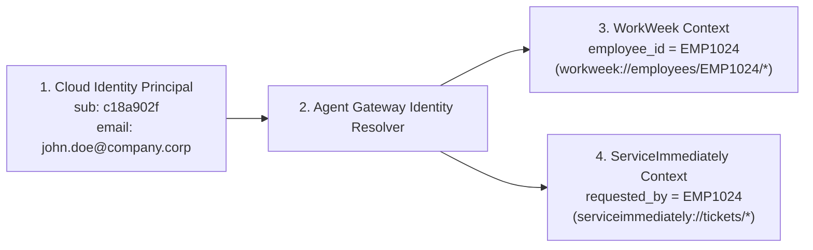

#### Detailed Identity Translation & Tenant Isolation Mechanics:
1. **Cryptographic Identity Extraction**:
   * When an employee interacts via the Gemini Enterprise App or Web Widget, the **GEAP Agent Gateway** verifies the cryptographic signature of the Cloud Identity OIDC token (`iss: "https://accounts.google.com"`).
   * It extracts verified claims: `email: "aishprabhat@google.com"` and `sub: "c18a902f-3829-4b11-9a72-8f921a890123"`.
2. **Deterministic Identity Resolution**:
   * The Agent Gateway resolves the principal against the enterprise directory cache, extracting the canonical employee number `EMP1024`.
   * Crucially, the foundation model **never sees or controls the caller's employee ID**. All tool invocations sent to the Integration Connectors have `employee_id = "EMP1024"` injected directly into the HTTP header/payload by the gateway runtime.
3. **Hard Tenant Isolation Enforcement**:
   * If a prompt attempts prompt injection or social engineering (e.g. *"Check leave balance for employee EMP9999"*), the sub-agent's tool execution is automatically bound to the session's authenticated `employee_id` (`EMP1024`), returning `403 Forbidden` if any foreign ID is requested.

#### Detailed Identity Translation Schema:
```json
{
  "cloud_identity_principal": {
    "subject_id": "c18a902f-3829-4b11-9a72-8f921a890123",
    "email": "aishprabhat@google.com",
    "directory_roles": ["roles/hr.employee", "roles/it.user"],
    "organization_unit": "Engineering/AI"
  },
  "downstream_system_mappings": {
    "workweek_hcm": {
      "employee_id": "EMP1024",
      "enforce_tenant_isolation": true,
      "permitted_resource_scopes": [
        "workweek://employees/EMP1024/profile",
        "workweek://employees/EMP1024/timeoff"
      ]
    },
    "service_immediately_itsm": {
      "requested_by": "EMP1024",
      "permitted_ticket_ownership": "EMP1024",
      "default_assignment_group": "Service Desk"
    }
  }
}
```

---

### 5.7. Downstream Concurrency, API Throttling & Heavy-Load Backoff

To protect enterprise ERP and ITSM systems from degradation during peak traffic hours (e.g. open enrollment periods, company-wide leave deadlines), the architecture enforces concrete downstream throttling thresholds via **Vertex AI Integration Connectors**:

#### 1. Explicit Gateway & Downstream Throttling Thresholds:
* **GEAP Agent Gateway Ingress Limits**:
  * **Per-User Rate Limit**: $50\text{ requests/minute}$ per authenticated Cloud Identity subject.
  * **Per-IP Rate Limit**: $500\text{ requests/minute}$ (for NAT gateways/corporate Wi-Fi).
  * **Global Concurrency Ceiling**: $2,000\text{ concurrent active WebSocket/SSE streams}$.
* **WorkWeek HCM MCP Limits**:
  * **Sustained Rate Limit**: $100\text{ requests/second}$
  * **Burst Capacity**: $150\text{ requests}$ (Token bucket replenishment rate: $100\text{ tokens/s}$)
  * **Max Concurrent Downstream Connections**: $50\text{ connections per connector pod}$
* **ServiceImmediately ITSM MCP Limits**:
  * **Sustained Rate Limit**: $50\text{ requests/second}$
  * **Burst Capacity**: $75\text{ requests}$ (Token bucket replenishment rate: $50\text{ tokens/s}$)
  * **Max Concurrent Downstream Connections**: $30\text{ connections per connector pod}$

#### 2. Downstream Circuit Breaker & Retry Configuration:
* **Circuit Breaker Policy**: If the $5\text{xx}$ error rate exceeds $15\%$ over a rolling 30-second window, the connector circuit opens immediately, blocking new outbound calls to that SaaS for 15 seconds to allow backend recovery.
* **Exponential Backoff with Full Jitter Formula**:
  $$t_{\text{wait}} = \min\left(t_{\text{max}}, \; t_{\text{base}} \times 2^{\text{attempt}}\right) \times \text{Uniform}(0.8, 1.2)$$
  Where $t_{\text{base}} = 500\text{ms}$, $t_{\text{max}} = 2000\text{ms}$, $\text{Max Attempts} = 3$.

---

### 5.8. Comprehensive Component Failure & Tabular Error-Handling Matrix

| Component Failure Scenario | Detection Trigger & Status | Root Cause & Failure Mode | Connector / SRE Automated Action | User-Facing Conversational Fallback Message |
| :--- | :--- | :--- | :--- | :--- |
| **Model Armor Latency Spike** | Ingress scan latency $> 500\text{ms}$ | Cloud DLP queue contention | SRE Warning (P3). Fallback to fast-path heuristic classifier. | Translucent streaming delay ($<800\text{ms}$ TTFT maintained). |
| **Model Armor Block (False Pos.)** | Model Armor `BLOCK` decision | User query flagged as adversarial | Security Audit emitted; turn intercepted by safe refusal. | *"Your request could not be processed due to enterprise safety and security guidelines."* |
| **WorkWeek API Timeout** | HTTP `504 Gateway Timeout` ($>3.5\text{s}$) | ERP database lock or network blip | 3x synchronous retries with jitter ($500\text{ms}, 1\text{s}, 2\text{s}$). | *"WorkWeek is taking longer than usual to respond. We are checking the status to ensure no duplicate actions occurred."* |
| **WorkWeek 500 Server Error** | HTTP `500 Internal Server Error` | Legacy ERP exception | 3x synchronous retries. If persistent, page SRE on-call (P2). | *"The HR system is experiencing a temporary service issue. Your request was not committed. Please try again shortly."* |
| **Duplicate Ticket Submission** | HTTP `409 Conflict` | Duplicate ticket within 5 minutes | No retry. Return conflict reason to sub-agent reasoning context. | *"A similar ticket was recently submitted within the last 5 minutes. To prevent duplicate orders, please wait a few minutes or comment on the existing ticket."* |
| **Insufficient Leave Balance** | HTTP `422 Validation Error` | Requested days exceed accrued hours | No retry. Sub-agent halts transaction. | *"You currently do not have enough accrued vacation hours for this request (16 hours requested vs. 8 hours available)."* |
| **Agent Gateway Rate Limit** | HTTP `429 Too Many Requests` | User exceeds 50 req/min limit | Enforce backoff header (`Retry-After: 30`). | *"You've sent several requests in a short time. Please wait 30 seconds before sending your next message."* |
| **WebSocket Stream Disconnect** | TCP RST / WS Code 1006 | Client Wi-Fi / network drop | Client auto-reconnects with exponential backoff; restores session. | Silent client-side reconnection banner: *"Reconnecting to live assistant..."* |
| **Token Revocation / Expire** | HTTP `401 Unauthorized` | Employee suspended or token expired | Gateway terminates session; wipes local memory. | *"Your enterprise session has expired. Please refresh your browser to re-authenticate."* |
| **Grounding Score Refusal** | `groundingScore < 0.85` | Policy unverified in HR handbook | Automated refusal gate intercepts turn; returns policy guidance. | *"I could not find an official corporate policy covering this topic in the HR Handbook. Please consult your HR Business Partner."* |

---

### 5.9. Column-Level Database Schemas for BigQuery & Session Storage

#### 5.9.1. BigQuery Analytics Dataset (`hr_agent_analytics`)

```sql
-- 1. Multi-turn Session Summary Table
CREATE TABLE `hr_agent_analytics.sessions` (
  session_id STRING NOT NULL,
  user_id_pseudonymized STRING NOT NULL,
  channel STRING NOT NULL, -- 'gemini_enterprise_app', 'google_chat', 'web_widget'
  start_time TIMESTAMP NOT NULL,
  end_time TIMESTAMP,
  total_turns INT64 NOT NULL,
  deflection_status STRING NOT NULL, -- 'DEFLECTED', 'ESCALATED_HUMAN', 'ABANDONED'
  hitl_confirmed_count INT64 DEFAULT 0,
  cost_usd NUMERIC(10, 4),
  session_duration_seconds INT64
)
PARTITION BY DATE(start_time)
CLUSTER BY channel, deflection_status;

-- 2. Turn-Level Telemetry & Evaluation Table
CREATE TABLE `hr_agent_analytics.turns` (
  turn_id STRING NOT NULL,
  session_id STRING NOT NULL,
  turn_index INT64 NOT NULL,
  timestamp TIMESTAMP NOT NULL,
  user_prompt_redacted STRING,
  orchestrator_thinking_tokens INT64,
  sub_agent_dispatched STRING, -- 'PolicyQAAgent', 'WorkWeekAgent', 'ServiceImmediatelyAgent'
  tool_call_name STRING,
  tool_latency_ms INT64,
  tool_http_status INT64,
  grounding_score FLOAT64,
  grounding_chunks ARRAY<STRING>,
  model_armor_verdict STRING, -- 'ALLOW', 'BLOCK', 'REDACTED'
  user_feedback STRING -- 'THUMBS_UP', 'THUMBS_DOWN', 'NONE'
)
PARTITION BY DATE(timestamp)
CLUSTER BY sub_agent_dispatched, tool_call_name;

-- 3. Asynchronous Online Evaluation Table
CREATE TABLE `hr_agent_analytics.eval_scores` (
  eval_run_id STRING NOT NULL,
  turn_id STRING NOT NULL,
  eval_timestamp TIMESTAMP NOT NULL,
  judge_model STRING NOT NULL, -- 'gemini-3.1-pro'
  tool_accuracy_score FLOAT64,
  faithfulness_score FLOAT64,
  safety_score FLOAT64,
  human_review_required BOOLEAN DEFAULT FALSE,
  reviewer_notes STRING
)
PARTITION BY DATE(eval_timestamp)
CLUSTER BY human_review_required;
```

#### 5.9.2. Vertex AI Agent Engine Internal Session State Document Structure

```json
{
  "_id": "session-c18a902f-89104",
  "employee_id": "EMP1024",
  "channel": "web_widget",
  "created_at": "2026-08-19T09:00:00Z",
  "last_interaction_time": "2026-08-19T09:05:30Z",
  "ttl_expiration_time": "2026-08-20T09:05:30Z",
  "active_workflow": {
    "workflow_type": "LEAVE_BOOKING",
    "step": "AWAITING_HITL_CONFIRMATION",
    "idempotency_key": "uuid-v4-789a",
    "draft_payload": {
      "start_date": "2026-08-27",
      "end_date": "2026-08-28",
      "leave_type": "Vacation",
      "days": 2.0
    }
  },
  "turn_history": [
    {
      "turn_id": "t-001",
      "role": "user",
      "content": "Can I take Aug 27 and 28 off?"
    },
    {
      "turn_id": "t-002",
      "role": "assistant",
      "action_proposal": {
        "card_type": "HITL_CONFIRMATION",
        "action": "request_time_off",
        "parameters": {"start_date": "2026-08-27", "end_date": "2026-08-28", "days": 2.0}
      }
    }
  ]
}
```

---

## 6. Sizing, Cost Estimation & FinOps (Baseline Topology)

The following baseline model sizes an enterprise production topology handling approximately 50,000 conversational interactions per month with scale-to-peak elasticity:

| GCP Managed Resource | Baseline Consumption Metric | Unit Cost Rate | Projected Monthly OPEX (USD) |
| :--- | :--- | :--- | :--- |
| **Vertex AI: Gemini 3.7 Flash (Sub-Agents & Q&A)** | ~50,000 queries/month ($\sim 1.5\text{K}$ tokens/turn) | \$0.10 / 1M input tok, \$0.40 / 1M output tok | \$7.50 |
| **Vertex AI: Gemini 3.1 Pro (Orchestrator, Sagas & Evals)** | ~5,000 complex turns + 2,500 sampled eval runs | \$1.25 / 1M input tok, \$5.00 / 1M output tok | \$22.50 |
| **GEAP Agent Gateway (AI Ingress & Throttling)** | ~50,000 gateway requests / month | Serverless gateway routing rate | \$2.00 |
| **GEAP Managed Agent Runtime (Vertex AI Engine)** | ~50,000 agent execution turns (serverless compute) | Standard serverless runtime execution rate | \$13.00 |
| **Vertex AI Integration Connectors (MCP Connector)** | ~25,000 tool executions / month | Standard connector node invocation rate | \$1.50 |
| **GEAP Agent Engine Sessions & Memory Bank** | ~50,000 managed sessions & memory operations | \$0.03 / 1,000 session queries | \$1.50 |
| **GEAP Observability & BigQuery Streaming Export** | ~50,000 streaming telemetry records into BigQuery | BigQuery streaming ingestion rate | \$0.50 |
| **Google Cloud Model Armor (AI Firewall)** | ~50,000 turns (Prompt, Payload & Egress inspection) | \$0.15 / 10,000 requests | \$1.50 |
| **Vertex AI Search Grounding (Private Data Store)** | 1 Enterprise Data Store, <100 MB policy documents | \$5.00 / 1,000 queries (includes Grounding Metadata) | \$18.00 |
| **Google Cloud Identity & Secret Manager** | Cloud Identity Standard / 1 Secret | Included in Cloud Identity / Standard Secret pricing | \$0.50 |
| **Cloud Operations Suite (Monitoring, Logging, Trace)** | Standard telemetry volume (~5 GB logs + trace spans) | \$0.50 / GB above free tier | \$1.00 |
| **Total Estimated Baseline Monthly OPEX** | — | — | **\$68.50 / month** |

#### FinOps Optimization Levers:
1. **Serverless Scale-to-Zero**: Eliminates idle compute charges during non-working hours and weekends.
2. **Vertex AI Context Caching**: High-frequency system instructions and core handbook passages are pre-cached in memory, cutting input token costs by up to $75\%$.
3. **Model Tiering Strategy**: Standardizing sub-agents on Gemini 3.7 Flash keeps 90% of model turns on ultra-low unit rates ($0.10/\text{M tok}$) while reserving Gemini 3.1 Pro strictly for root intent classification and complex multi-system sagas.

---

## 7. Infrastructure as Code (IaC), GitOps & Implementation Roadmap

### 7.1. Terraform Module Architecture Tree

> 💼 **Executive Architecture Summary**: Depicts the modular Infrastructure as Code (IaC) hierarchy: organizes infrastructure into reusable, tested Terraform modules across environments (dev, staging, prod), enforcing environment-tiered logging (30d dev / 365d prod lock) and remote GCS state locking.

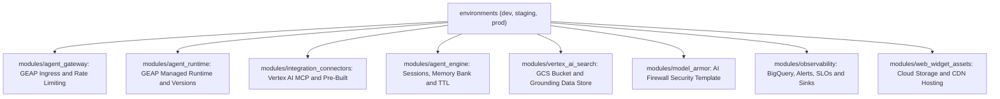

#### Detailed Module Descriptions:
* **`modules/agent_gateway`**: Provisions the `google_vertex_ai_agent_gateway` resource managing Cloud Identity OAuth2 authentication, rate limiting, and SSE/WebSocket protocol termination.
* **`modules/agent_runtime`**: Configures serverless ADK 2.0 multi-agent hosting with scale-to-zero auto-scaling.
* **`modules/integration_connectors`**: Manages `google_integration_connectors_connection` for WorkWeek and ServiceImmediately MCP endpoints with synchronous retry parameters.
* **`modules/agent_engine`**: Manages multi-turn session persistence, memory banking, and server-side context caching.
* **`modules/vertex_ai_search`**: Provisions CMEK Cloud Storage raw policy buckets and the Discovery Engine data store with hybrid vector indexing.
* **`modules/model_armor`**: Configures active prompt shields, sensitive PII de-identification templates, and egress malicious URL filters.
* **`modules/observability`**: Deploys BigQuery streaming datasets, Cloud Monitoring alert policies (PagerDuty/Slack), 99.9% SLOs, and 365-day locked compliance log buckets in `prod`.
* **`modules/web_widget_assets`**: Provisions Cloud Storage and Cloud CDN backend buckets hosting the compiled `<hr-assistant-widget />` bundle.

---

### 7.2. Cloud Build GitOps Deployment Pipeline

Continuous delivery and infrastructure management are codified through a declarative **Cloud Build GitOps Pipeline**. This ensures that all infrastructure modifications, agent prompt updates, and security policies undergo automated linting, security scanning, speculative plan verification, and multi-channel publication without manual ClickOps.

> 💼 **Executive Architecture Summary**: Details the automated GitOps deployment lifecycle: runs static security linting (tflint, tfsec), generates speculative execution plans via Workload Identity, executes automated 500+ golden quality eval gates, applies Terraform state changes, and publishes agent versions across Gemini Enterprise App and Cloud CDN Web Widgets.

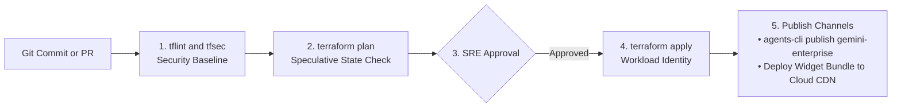

#### Detailed Stage-by-Stage GitOps Workflow:
1. **Stage 1: Static Code Analysis & Security Compliance**:
   * Triggered automatically upon opening a Pull Request against the main branch.
   * Cloud Build executes `tflint` to validate Terraform syntax against Google provider best practices, followed by `checkov` and `tfsec` to verify compliance with Google Cloud CIS benchmarks (enforcing CMEK encryption on buckets and verifying zero public IP exposures).
2. **Stage 2: Speculative State Plan Generation**:
   * Cloud Build authenticates using **Workload Identity Federation** (eliminating static service account keys) and executes `terraform plan -out=tfplan`.
   * The generated plan file is cryptographically hashed and saved in a dedicated plan artifact bucket, outputting an exact visual diff of resources to be created, modified, or destroyed.
3. **Stage 3: Automated Quality Gate & Peer Review**:
   * The pipeline runs the **Offline Golden Evaluation Suite** (Section 9.1) against a staging instance. If tool selection accuracy is $<98\%$ or grounding score is $<0.85$, the pipeline blocks automatically.
   * Designated SRE and Security reviewers inspect the plan diff and evaluation metrics in GitHub/GitLab and grant cryptographic merge approval.
4. **Stage 4: Automated Terraform Apply**:
   * Merging to `main` triggers the deployment stage, which applies the approved `tfplan` across target Google Cloud environments (`dev` $\rightarrow$ `staging` $\rightarrow$ `prod`).
5. **Stage 5: Multi-Channel Agent Publication**:
   * Upon successful infrastructure provisioning, Cloud Build executes the post-deployment publication step:
     * **Gemini Enterprise App**: Invokes `agents-cli publish gemini-enterprise` to register the new agent version in the corporate Workspace Agent Directory.
     * **Intranet Web Widget Assets**: Compiles the `<hr-assistant-widget />` bundle and deploys the static JavaScript/CSS assets to Cloud Storage (`gs://${PROJECT_ID}-assets/`) with Cloud CDN cache invalidation.

---

### 7.3. Terraform Resource Mapping Matrix

| Architecture Component | Target Terraform Resource | Terraform Module Path | Sizing & Security Attributes |
| :--- | :--- | :--- | :--- |
| **Model Armor AI Firewall Template** | `google_model_armor_template` | `modules/model_armor` | Active filters: `prompt_injection { enabled = true }`, `malicious_urls { enabled = true }`, `sensitive_data_protection { inspect_template = "hr-pii-masking" }`, `harm_categories { threshold = "MEDIUM_AND_ABOVE" }`. |
| **GEAP Agent Gateway** | `google_vertex_ai_agent_gateway` | `modules/agent_gateway` | Cloud Identity OAuth2 authentication, rate limit 50 req/min/user, streaming SSE & WebSockets enabled. |
| **GEAP Managed Agent Runtime** | `google_vertex_ai_agent_runtime` | `modules/agent_runtime` | Serverless runtime execution, ADK 2.0 bundle, auto-scaling 0 to 5, native session binding. |
| **Vertex AI Integration Connectors** | `google_integration_connectors_connection` | `modules/integration_connectors` | Managed MCP Connector configured with endpoints `/work-week/mcp/` and `/service-immediately/mcp/` + synchronous retry policy. |
| **Vertex AI Agent Engine** | `google_vertex_ai_agent_engine` | `modules/agent_engine` | Managed multi-turn `SessionService`, `MemoryBank`, context caching enabled, session TTL 24h. |
| **Web Widget CDN Assets** | `google_storage_bucket` + `google_compute_backend_bucket` | `modules/web_widget_assets` | Hosts compiled `<hr-assistant-widget />` bundle with Cloud CDN caching. |
| **GEAP BigQuery Analytics Export** | `google_bigquery_dataset` | `modules/observability` | Dataset `hr_agent_analytics` with streaming table partitions for sessions, turns, and eval scores. |
| **Cloud Operations SRE Alerts** | `google_monitoring_alert_policy` | `modules/observability` | Multi-channel dispatch to PagerDuty/Slack for P95 latency $>5\text{s}$, Model Armor surge, and 5xx errors $>2\%$. |
| **Service Level Objective (SLO)** | `google_monitoring_slo` | `modules/observability` | $99.9\%$ Availability SLO and $<3.5\text{s}$ P95 Latency SLO with automated error budget alerting. |
| **Compliance Immutable Log Bucket** | `google_logging_project_bucket_config` | `modules/observability` | Bucket `hr-audit-compliance-logs` with retention: 30d in Dev/Staging; 365d locked in Prod with CMEK. |
| **Enterprise SIEM Log Sink** | `google_logging_project_sink` | `modules/observability` | Exports high-severity security events to Google Security Operations (Chronicle) / Splunk. |
| **Online Evaluation Pipeline** | `google_vertex_ai_eval_schedule` | `modules/eval_pipeline` | $5\%$ live traffic sampling, automated scoring with Gemini 3.1 Pro Judge, human annotation routing. |
| **MCP Secret Storage** | `google_secret_manager_secret` | `modules/secret_manager` | `replication { auto {} }`, IAM binding granting Agent Runtime Service Account `roles/secretmanager.secretAccessor`. |
| **HR Policy Bucket** | `google_storage_bucket` | `modules/vertex_ai_search` | `uniform_bucket_level_access = true`, `versioning { enabled = true }`, `force_destroy = false`. |
| **Vertex Policy Data Store (Grounding)** | `google_discovery_engine_data_store` | `modules/vertex_ai_search` | `industry_vertical = "GENERIC"`, `solution_types = ["SOLUTION_TYPE_SEARCH"]`, `content_config = "CONTENT_REQUIRED"`. |

---

### 7.4. Structured 8-Week Implementation Roadmap, Milestones & Resource Roles

To ensure predictable enterprise delivery, the solution follows an **8-Week Phased Implementation Roadmap** across 4 two-week sprints.

> 💼 **Executive Architecture Summary**: Details the 8-week production implementation roadmap across 4 sprints: progresses from Foundation & Security Setup (Sprint 1) to Agent Mesh & Grounding (Sprint 2), Dual Frontend & Quality Evals (Sprint 3), and Staging Dry-Run to Prod Cutover (Sprint 4).

```mermaid
gantt
    title Production HR Agentic Solution - 8-Week Implementation Timeline
    dateFormat  YYYY-MM-DD
    section Sprint 1: Infra & Security
    Terraform Baseline & Ingress Gateway   :2026-09-01, 7d
    Model Armor & Cloud Identity Setup     :2026-09-05, 9d
    MCP Connectors (WorkWeek/ITSM)         :2026-09-08, 6d
    section Sprint 2: Core Agent Mesh
    Hierarchical ADK Mesh Development      :2026-09-15, 8d
    Vertex AI Search Grounding Ingestion   :2026-09-18, 7d
    HITL State Checkpointing Engine        :2026-09-22, 6d
    section Sprint 3: Frontends & Quality
    Gemini Enterprise App Publication      :2026-09-29, 6d
    Web Widget with Live Voice Streaming   :2026-10-02, 8d
    500+ Golden Eval CI/CD Quality Gate    :2026-10-06, 7d
    section Sprint 4: Hardening & Go-Live
    Two-Tier SRE Observability & Alerts    :2026-10-13, 6d
    Security Penetration & DPO Review      :2026-10-16, 6d
    Production Canary (10% to 100%)        :2026-10-20, 6d
```

#### Detailed Sprint Breakdown & Milestones:
* **Sprint 1 (Weeks 1–2): Foundation, Security Perimeter & Ingress**:
  * *Deliverables*: Provision core Google Cloud projects, VPC-SC boundaries, GEAP Agent Gateway with rate-limiting ($50\text{ req/min}$), Model Armor inline PII inspection template, and Vertex AI Integration Connectors for WorkWeek and ServiceImmediately MCP endpoints.
  * *Milestone M1*: Successful authenticated test call through Agent Gateway and Model Armor to `/work-week/mcp/`.
* **Sprint 2 (Weeks 3–4): Multi-Agent Core, Grounding & State Engine**:
  * *Deliverables*: Codify Root Orchestrator (`Gemini 3.1 Pro`) and Sub-Agents (`Gemini 3.7 Flash`), ingest corporate PDF handbooks into Vertex AI Search with layout chunking, and wire Vertex AI Agent Engine session state persistence with UUIDv4 idempotency checkpoints.
  * *Milestone M2*: End-to-end execution of Leave Booking and Equipment Procurement sagas in staging.
* **Sprint 3 (Weeks 5–6): Dual Frontends & Quality Benchmark Gate**:
  * *Deliverables*: Publish assistant to Gemini Enterprise App and Google Chat via `agents-cli publish gemini-enterprise`. Build and embed `<hr-assistant-widget />` with Gemini Multimodal Live voice streaming toggle. Build 500+ golden eval dataset in CI/CD pipeline.
  * *Milestone M3*: $\ge 98\%$ tool calling accuracy and $\ge 0.85$ grounding score achieved on golden test benchmark.
* **Sprint 4 (Weeks 7–8): SRE Hardening, Compliance Sign-off & Production Cutover**:
  * *Deliverables*: Configure Cloud Operations alert policies (PagerDuty/Slack), 99.9% SLOs, BigQuery streaming dashboards, DPO privacy sign-off, and execute canary rollout ($10\%$ corporate pilot $\rightarrow$ $100\%$ enterprise general availability).
  * *Milestone M4*: Full production general availability with 365-day locked compliance audit logging.

#### Resource Role Requirements:
| Role Title | Responsibilities | Allocation |
| :--- | :--- | :--- |
| **Enterprise AI Lead Architect** | Multi-agent mesh design, grounding verification policy, overall system topology. | $100\%$ Full-Time (Weeks 1–8) |
| **Backend Integration Engineer** | MCP connector development, FastMCP tuning, Secret Manager wiring, error retry matrix. | $100\%$ Full-Time (Weeks 1–6) |
| **Frontend Web / Live API Specialist** | Dual-mode `<hr-assistant-widget />`, WebSockets, Gemini Live audio stream, HITL Action cards. | $50\%$ Part-Time (Weeks 4–7) |
| **Data Protection & InfoSec Lead** | Model Armor PII profiles, GDPR Art. 17 erasure workflows, DPO audit approval. | $25\%$ Milestone Review (Weeks 2, 7) |
| **DevOps / Cloud SRE Engineer** | Terraform modularization, Cloud Build GitOps, PagerDuty alerting, 99.9% SLO policies. | $100\%$ Full-Time (Weeks 1–8) |

---

## 8. Comprehensive Risk & Mitigation Matrix

| Risk ID | Risk Scenario | Severity | Impact | Architectural Mitigation Strategy |
| :--- | :--- | :--- | :--- | :--- |
| **RSK-01** | **Direct Prompt Injection**<br>Adversary uses jailbreak prompts to manipulate root orchestrator. | **Critical** | System prompt leakage, erratic behavior | **Google Cloud Model Armor Prompt Shield**: Intercepts and drops direct prompt injections at ingress before prompt reaches Gemini models. |
| **RSK-02** | **Indirect Prompt Injection**<br>Adversary embeds prompt instructions inside IT ticket comments or WorkWeek notes. | **Critical** | Sub-agent hijacking via tool returns | **Model Armor Payload Sanitizer**: Inspects all tool and resource return payloads, stripping embedded imperative instructions. |
| **RSK-03** | **Malicious URLs / Phishing**<br>Chat conversation or support ticket introduces phishing links. | **High** | Corporate network compromise | **Model Armor Malicious URL Filter**: Validates all input and output URLs against Google Web Risk threat intelligence feeds. |
| **RSK-04** | **Backend ERP Overload**<br>High concurrent requests degrade downstream SaaS endpoints. | **High** | System slowdown / 503 errors | **GEAP Agent Gateway Rate Limiter & Synchronous Retries**: Enforces 50 req/min/user limit and executes 3 synchronous retries with jitter before returning graceful conversational fallback. |
| **RSK-05** | **SPII Leakage into Logs**<br>Personal phone or address logged in plain text. | **Critical** | GDPR / CCPA violation | **Model Armor Sensitive Data Protection & Locked Bucket**: Built-in de-identification templates mask sensitive info types; audit logs stored in environment-tiered CMEK bucket. |
| **RSK-06** | **Factual Policy Hallucination**<br>LLM invents numbers or false benefit terms. | **Critical** | Employee misinformation | **Vertex AI Search Grounding Verification Gate**: Validates every sentence via `groundingSupports`; scores $<0.85$ automatically trigger safe policy refusal. |
| **RSK-07** | **Network Timeout Duplication**<br>Network drops after backend write; retry creates duplicate. | **High** | Double booking of leave, duplicate tickets | **Idempotency Key Engine**: Client UUIDv4 `idempotency_key` checkpointed in Vertex AI Agent Engine guarantees exactly-once execution. |
| **RSK-08** | **Production Quality & Concept Drift**<br>New HR policies or phrasing cause model divergence. | **High** | Degraded user experience | **GEAP Semantic Drift Detection & Online Evaluation**: 5% traffic sampling with Gemini 3.1 Pro Judge flags low scores for human review. |

---

## 9. Two-Tier Observability, Quality Flywheel & Fleet Governance

### 9.1. Closed-Loop Quality Flywheel: Offline & Online Evals

Agentic systems operating in production require a continuous, closed-loop quality flywheel that combines **pre-deployment regression gates** in CI/CD with **post-deployment live monitoring**. The architecture standardizes on the **Vertex AI Gen AI Evaluation Service**, employing **Gemini 3.1 Pro** as an automated LLM-as-a-Judge.

> 💼 **Executive Architecture Summary**: Illustrates the closed-loop AI quality flywheel: enforces a pre-deployment 500+ golden test case CI/CD blocker evaluated by Gemini 3.1 Pro Judge (>=98% accuracy gate), continuously samples 5% of production traffic, and routes low-scoring turns to an automated human review queue for continuous dataset enrichment.

```mermaid
flowchart LR
    subgraph Offline ["1. Pre-Deployment - CI/CD"]
        Golden["500+ Golden Dataset"] --> JudgeOff["Gemini 3.1 Pro Judge"]
        JudgeOff --> Gate{"Score >= 98 percent?"}
        Gate -- Pass --> Deploy["Promote to Prod"]
        Gate -- Fail --> Block["Block Release"]
    end

    subgraph Online ["2. Post-Deployment - Continuous"]
        Deploy --> Traffic["Live Traffic (5% Sample)"]
        Traffic --> JudgeOn["Online Background Judge"]
        JudgeOn --> LowScore{"Score under 0.85?"}
        LowScore -- Yes --> Review["Human Review Queue"]
        Review --> Golden
    end
```

#### Detailed Narrative of the Flywheel Stages:
1. **Offline Pre-Deployment Benchmarking (CI/CD Quality Gate)**:
   * Prior to promoting any agent code, prompt change, or Terraform configuration, Cloud Build runs the **Golden Evaluation Benchmark**.
   * The benchmark contains over $500$ multi-turn test cases covering complex cross-system scenarios, adversarial prompt injection attempts, ambiguous leave dates, and edge-case policy questions.
   * **Gemini 3.1 Pro (LLM Judge)** evaluates model outputs against ground truth on multiple quantitative dimensions: tool calling schema precision, parameter extraction accuracy, and grounding faithfulness. If tool accuracy is $<98\%$ or grounding score is $<0.85$, the CI/CD pipeline blocks deployment automatically.
2. **Online Continuous Evaluation (Live Traffic Sampling)**:
   * In production, the system randomly samples **$5\%$ of all active employee interactions**, along with $100\%$ of interactions where employees provide negative feedback (thumbs down) or cancel a HITL confirmation card.
   * An asynchronous background evaluation job evaluates the sampled conversation turns against safety, tone, policy accuracy, and tool resolution efficiency.
3. **Automated Human Review Queue & Dataset Feedback Loop**:
   * Sampled turns scoring below $0.85$ are automatically routed to the **Vertex AI Human Annotation Queue**. HR specialists and enterprise architects review the failure transcripts, annotate corrections, and tag the root cause (e.g. ambiguous prompt, missing document chunk, or tool parameter drift).
   * Annotated corrections are merged back into the Golden Dataset, ensuring that the model never makes the same mistake twice as new policies are released.

---

### 9.2. Two-Tier Observability: AI Semantics + SRE Infrastructure

> 💼 **Executive Architecture Summary**: Visualizes the unified two-tier observability suite: Tier 1 delivers deep AI-semantic visibility (trajectory debugging, thinking tokens, semantic drift, BigQuery/Looker Studio analytics), while Tier 2 provides 24/7 Cloud Operations SRE alerting (PagerDuty/Slack), 99.9% SLO tracking, and 365-day immutable compliance logs.

```mermaid
flowchart TD
    AgentCore["ADK Multi-Agent Execution Core"]
    
    subgraph Tier1 ["Tier 1: GEAP AI-Semantic Observability"]
        AgentCore --> Trajectory["Trajectory Debugger: Thinking and Payloads"]
        AgentCore --> Drift["Semantic Drift and Feedback Telemetry"]
        AgentCore --> BigQuery["BigQuery Streaming to Looker Studio"]
    end

    subgraph Tier2 ["Tier 2: Google Cloud Operations SRE Suite"]
        AgentCore --> Monitoring["Cloud Monitoring Alerts: PagerDuty and Slack"]
        AgentCore --> ErrorRep["Cloud Error Reporting: Crash Deduplication"]
        AgentCore --> LogBucket["365-Day Locked Compliance Bucket"]
    end
```

#### Detailed Breakdown of Observability Tiers:

##### 1. Tier 1: GEAP Native AI-Semantic Observability
* **Visual Trajectory Debugging**: Developers and SREs can inspect any historical turn in the GEAP Console to view the complete reasoning graph: exact sub-agent dispatch commands, model thinking mode tokens, raw MCP tool arguments and JSON responses, Model Armor inspection verdicts, and exact grounding citation metadata.
* **Semantic Drift Detection**: Automatically calculates statistical distribution shifts in employee questions against baseline embeddings, immediately alerting when employees ask unhandled policy topics or new phrasing patterns emerge.
* **BigQuery Streaming Export & Looker Studio**: Turns, latency spans, tool executions, and evaluation scores stream into partitioned BigQuery tables (`hr_agent_analytics.sessions`, `hr_agent_analytics.turns`) powering executive Looker Studio dashboards visualizing Tier-1 HR deflection rates, top policy FAQs, and tool failure heatmaps.

##### 2. Tier 2: Google Cloud Operations SRE Suite
* **24/7 Incident Alerting**: Multi-channel automated alerting dispatching high-severity incidents to **PagerDuty, Slack (`#hr-agent-sre`), Email, and SMS**.
* **SLO Error Budget Tracking**: Enforces $99.9\%$ Availability SLO (non-5xx responses) and $<3.5\text{s}$ P95 Latency SLO, automatically alerting on-call engineers when $2\%$ of the 30-day error budget is consumed in a 1-hour window.
* **Cloud Error Reporting**: Automatically captures, deduplicates, and groups unhandled runtime exceptions, linking new crash signatures to tracking issues.
* **365-Day Immutable Compliance Log Bucket**: Dedicated Cloud Logging bucket locked in `prod` with CMEK encryption satisfying GDPR Art. 30 and SOX compliance requirements.

---

### 9.3. Distributed Latency Waterfall Flow

Achieving an exceptional conversational experience requires granular visibility into every millisecond spent across the distributed architecture. The system leverages **Cloud Trace** and **OpenTelemetry** with W3C `traceparent` propagation to capture span-level latency metrics across all four operational stages.

> 💼 **Executive Architecture Summary**: Breaks down end-to-end conversational turn latency across 4 discrete stages: Ingress & Security (125ms), Root Orchestration (525ms), Parallel Tool & RAG Execution (550ms), and Delivery & Streaming Egress (150ms), achieving a responsive P95 Time-to-First-Token (TTFT) of ~1.35 seconds.

```mermaid
flowchart LR
    Ingress["1. Ingress & Security<br>Gateway Auth (45ms)<br>Model Armor Scan (80ms)"] --> Orch["2. Root Orchestration<br>Gemini 3.1 Pro (525ms)"]
    Orch --> Parallel["3. Parallel Execution<br>Policy Search (500ms)<br>WorkWeek Tool (550ms)"]
    Parallel --> Delivery["4. Delivery & Egress<br>Model Armor Out (80ms)<br>Gemini App Stream (70ms)"]
```

#### Detailed Stage-by-Stage Latency Breakdown:
1. **Stage 1: Ingress Authentication & Model Armor Security Scan ($125\text{ms}$)**:
   * **Agent Gateway Auth ($45\text{ms}$)**: Cloud Identity OAuth2 Bearer token cryptographic verification, JWT signature check, and rate-limiter token bucket lookup.
   * **Model Armor Ingress Shield ($80\text{ms}$)**: Real-time heuristic and classification scan for direct prompt injections, jailbreak patterns, and inline PII de-identification (`[REDACTED_SSN]`).
2. **Stage 2: Root Orchestration Reasoning ($525\text{ms}$)**:
   * **Gemini 3.1 Pro Execution**: Evaluates user intent, processes multi-turn conversation memory, determines sub-agent routing requirements, and formats parallel dispatch commands.
3. **Stage 3: Parallel Tool Execution & Grounded Retrieval ($550\text{ms}$)**:
   * **Vertex AI Search Grounding ($500\text{ms}$)**: Vector similarity search over `text-embedding-005` index, BM25 hybrid ranking, chunk retrieval, and `groundingMetadata` generation.
   * **WorkWeek Integration Connector Tool ($550\text{ms}$)**: Managed MCP Connector connection pooling, TLS handshake, Secret Manager token injection, and Streamable HTTP round-trip to `/work-week/mcp/`.
   * *Because Stage 3 executes concurrently via `asyncio.gather`, total wait time is bounded by $\max(500\text{ms}, 550\text{ms}) = 550\text{ms}$*.
4. **Stage 4: Delivery, Response Shield & Streaming Egress ($150\text{ms}$)**:
   * **Model Armor Response Shield ($80\text{ms}$)**: Scans outbound model markdown for malicious URLs against Google Web Risk threat intelligence feeds.
   * **SSE / WebSocket Streaming Egress ($70\text{ms}$)**: Delivers initial response chunks to the Gemini Enterprise App or Web Widget, achieving a **P95 Time-to-First-Token (TTFT) of $\mathbf{\sim 1.35\text{s}}$**.

---

### 9.4. Custom Agent Metrics & SRE Operational Alerting Thresholds

| Metric Identifier | Metric Type | Target SLA | SRE Alerting Condition & Severity | Automated Action / Runbook |
| :--- | :--- | :--- | :--- | :--- |
| `agent/turn_latency_p95` | Distribution | $< 3.5\text{s}$ | **P95 Latency $> 5.0\text{s}$ for 5 consecutive minutes** (`Severity: P2`) | Trigger GEAP auto-scaler scale-up; inspect downstream MCP backend latency. |
| `agent/model_armor_blocks` | Counter / Rate | $< 0.5\%$ | **Prompt injection block surge $> 5\%$ over 2 minutes** (`Severity: P1 Security`) | Inspect malicious IP/user patterns; trigger Agent Gateway automated IP rate-limiting block. |
| `agent/tool_5xx_failures` | Counter / Rate | $< 0.1\%$ | **5xx Error Rate $> 2.0\%$ over 3 minutes** (`Severity: P1`) | Immediate synchronous retries with jitter; alert on-call SRE to verify SaaS availability. |
| `agent/grounding_score_avg` | Gauge | $\ge 0.85$ | **Average grounding score $< 0.80$ for 15 minutes** (`Severity: P2 Quality`) | Inspect recent policy document updates or query drift in BigQuery. |
| `agent/hitl_bypasses` | Counter | $0$ | **Any mutating tool invocation without HITL approval token** (`Severity: P0 Security`) | Terminate agent turn immediately; audit security middleware logs. |
| `agent/slo_error_budget_burn` | Gauge / Rate | $< 1\times$ | **Error budget burn rate $> 2\times$ over 1 hour** (`Severity: P1`) | Page on-call SRE; freeze pending GitOps deployment pipeline. |
| `agent/context_cache_hit_rate` | Gauge / Rate | $\ge 70.0\%$ | **Cache hit rate $< 50\%$ over 15 minutes** (`Severity: P3 FinOps`) | Check system prompt stability and Vertex AI context cache TTL expiration settings. |
| `agent/online_eval_score` | Gauge | $\ge 0.90$ | **Average sampled online score $< 0.85$ over 1 hour** (`Severity: P2 Quality`) | Flag low-scoring conversation transcripts for immediate human review in Annotation Queue. |

---

### 9.5. GEAP Fleet Governance & Prompt Management

* **Vertex AI Agent Registry**: Centralized repository managing all enterprise sub-agents, tool definitions, and version tags (`v1.0.0-prod`), supporting canary traffic routing ($90\%$ prod / $10\%$ canary) and one-click rollbacks.
* **Vertex AI Prompt Management & Studio**: Version-controlled prompt repository tracking system instruction diffs, temperature locks, and thinking budget settings.
* **Vertex AI Context Caching**: Server-side context caching of static system prompts and policy index embeddings, cutting token costs by up to $75\%$ and accelerating time-to-first-token.

---

## 10. Assumptions / Open Decisions

### 10.1. Documented Assumptions
| ID | Assumption Summary | Impacted Area | Validation Status |
| :--- | :--- | :--- | :--- |
| **ASM-01** | Google Cloud Model Armor API, GEAP Agent Gateway, Managed Agent Runtime, and Vertex AI Integration Connectors are enabled in region `us-central1`. | AI Security / Platform | `Validated` |
| **ASM-02** | Terraform remote state bucket `gs://${PROJECT_ID}-tfstate-*` is provisioned with CMEK encryption. | Infrastructure / IaC | `Validated` |
| **ASM-03** | User identities are managed in **Google Cloud Identity** or federated via corporate SAML/OIDC IdP. | Identity & Access | `Validated` |
| **ASM-04** | Target SaaS integration endpoints expose stateless Model Context Protocol (MCP) interfaces accessible via `X-MCP-Token`. | System Integrations | `Validated` |
| **ASM-05** | HR Policy repository will be supplied as sanitized PDF/Markdown documents prior to production ingestion. | Policy Q&A Engine | `Pending Delivery` |

### 10.2. Outstanding Design Decisions & Action Items
| ID | Open Decision / Question | Owner | Selected Option & Strategy | Status |
| :--- | :--- | :--- | :--- | :--- |
| **DEC-01** | Model Armor Prompt Block Fallback Behavior: Strict Drop vs Generic De-escalation Message. | InfoSec & AI Ethics Lead | **Selected Option A**: Return generic safe refusal: *"Your request could not be processed due to safety and security policy restrictions."* | `Resolved` |
| **DEC-02** | Selection of exact sync schedule for policy document ingestion (`FR-5.5`): Webhook trigger vs Hourly Cron. | Enterprise Arch & HR Team | **Selected Option A**: Eventarc/PubSub webhook trigger from document CMS on change. | `Resolved` |
| **DEC-03** | Enterprise Conversational UI & Client delivery surfaces. | Product Lead / EX Team | **Selected Option A**: **Dual Enterprise Surfaces**: (1) **Gemini Enterprise App & Google Chat** (Primary Workspace) + (2) **Embeddable Dual-Mode Web Widget** (Intranet Portal). | `Resolved` |

---
*End of Solution Design Document (v32.0 — Production Architecture Specification).*
